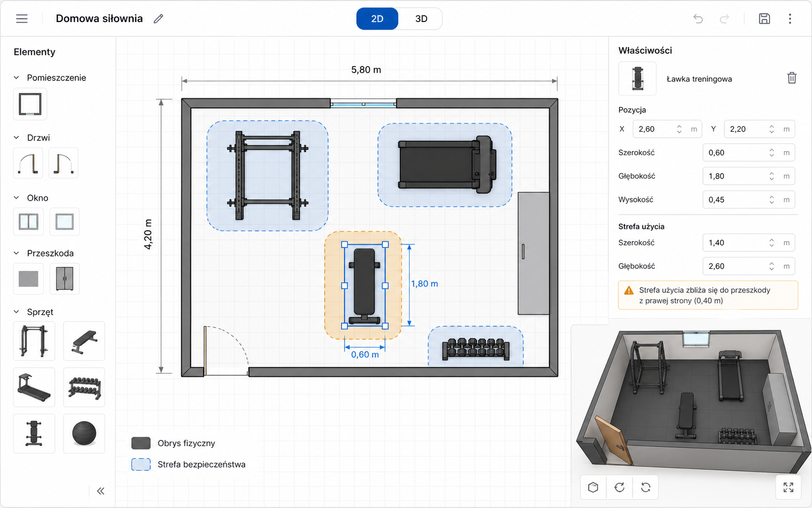

# Home Gym Creator — makieta edytora

## Makieta

Makieta przedstawia prosty edytor 2.5D przeznaczony do planowania domowej siłowni. Nie jest to profesjonalny program CAD ani realistyczny symulator wnętrz. Interfejs służy do wygodnego ustawiania prostych obiektów geometrycznych oraz sprawdzania, czy sprzęt i wymagane strefy użytkowe mieszczą się w pomieszczeniu.

## Układ interfejsu

### Pasek górny

Pasek zawiera nazwę projektu, przełącznik widoku **2D / 3D**, cofanie i ponawianie zmian oraz zapis projektu.

### Panel elementów

Lewy panel udostępnia elementy, które można dodać do projektu:

- pomieszczenie i jego ściany,
- drzwi wraz ze strefą otwierania,
- okna,
- przeszkody, takie jak szafa, kaloryfer lub niedostępny obszar,
- sprzęt treningowy z katalogu.

Elementy mogą być przeciągane na plan, a następnie przesuwane, obracane i usuwane.

### Obszar roboczy

Centralną część interfejsu zajmuje plan pomieszczenia. Widoczne są na nim wymiary, ściany, drzwi, okna, przeszkody i sprzęt.

Każdy sprzęt może prezentować dwie powierzchnie:

- **obrys fizyczny** — miejsce rzeczywiście zajmowane przez urządzenie,
- **strefę bezpieczeństwa** — dodatkową przestrzeń potrzebną do ćwiczeń, dostępu albo bezpiecznej obsługi.

Zaznaczony element otrzymuje uchwyty edycji oraz wymiary. Kolizje i zbyt małe odstępy są sygnalizowane ostrzeżeniami.

### Panel właściwości

Prawy panel pokazuje parametry zaznaczonego elementu:

- pozycję,
- szerokość,
- głębokość,
- wysokość,
- wymiary strefy użytkowej,
- komunikaty o kolizjach i ograniczeniach.

Zmiany wykonane w formularzu od razu aktualizują oba widoki.

## Przełącznik 2D / 3D

Przełącznik zmienia sposób prezentowania tego samego projektu. Widoki nie mają osobnych danych — korzystają ze wspólnego modelu geometrycznego.

### Widok 2D

Widok 2D jest podstawowym trybem edycji. Pokazuje pomieszczenie z góry i pozwala dokładnie:

- ustawiać oraz obracać wyposażenie,
- zmieniać wymiary i pozycje elementów,
- kontrolować odległości,
- porównywać obrys fizyczny ze strefą bezpieczeństwa,
- sprawdzać kolizje z przeszkodami i strefami otwierania drzwi.

### Widok 3D

Widok 3D jest pomocniczym podglądem przestrzennym. Pomieszczenie, przeszkody i sprzęt są przedstawiane jako proste bryły, bez realistycznych modeli i materiałów.

Użytkownik może obracać kamerę, przybliżać projekt oraz oglądać go z różnych stron. Widok pomaga sprawdzić:

- wysokość sprzętu względem sufitu,
- relację sprzętu do okien i elementów ściennych,
- wizualne zagęszczenie pomieszczenia,
- dostępność przejść,
- ogólną czytelność i funkcjonalność układu.

Główna zasada interakcji brzmi: **2D służy do precyzyjnego projektowania, a 3D do przestrzennej kontroli rezultatu**.

## Źródło prawdy

Oba widoki są jedynie różnymi reprezentacjami tego samego modelu 2.5D. Pozycje, rozmiary, wysokości i strefy użytkowe są przechowywane jako proste dane geometryczne. Walidacja układu nie zależy od grafiki 3D i pozostaje deterministyczna.

