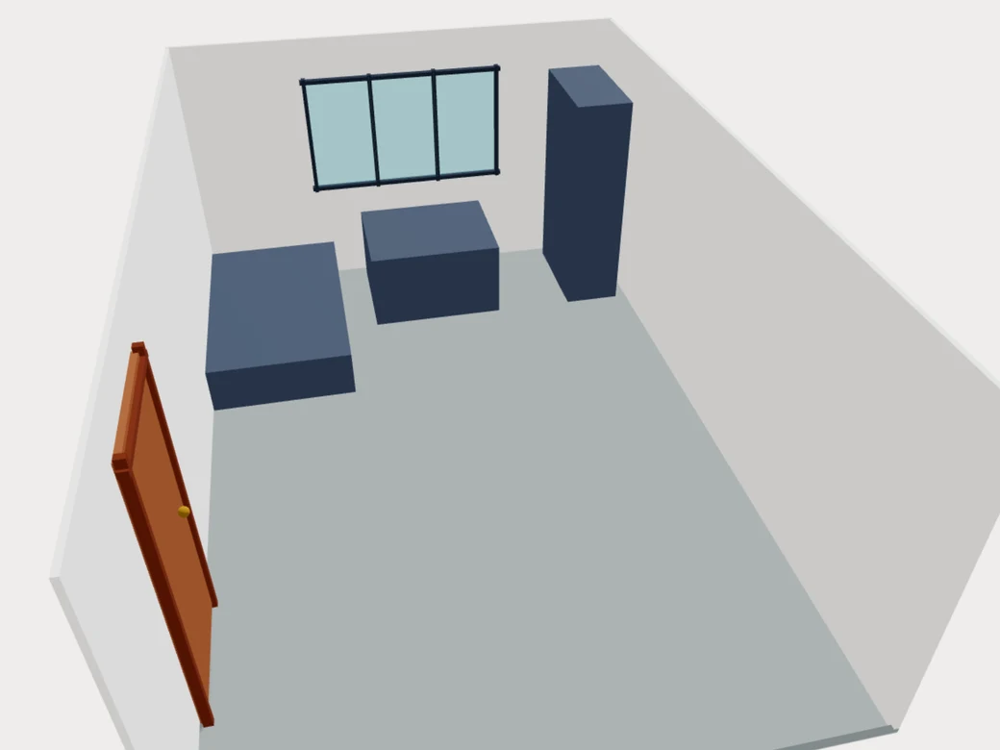
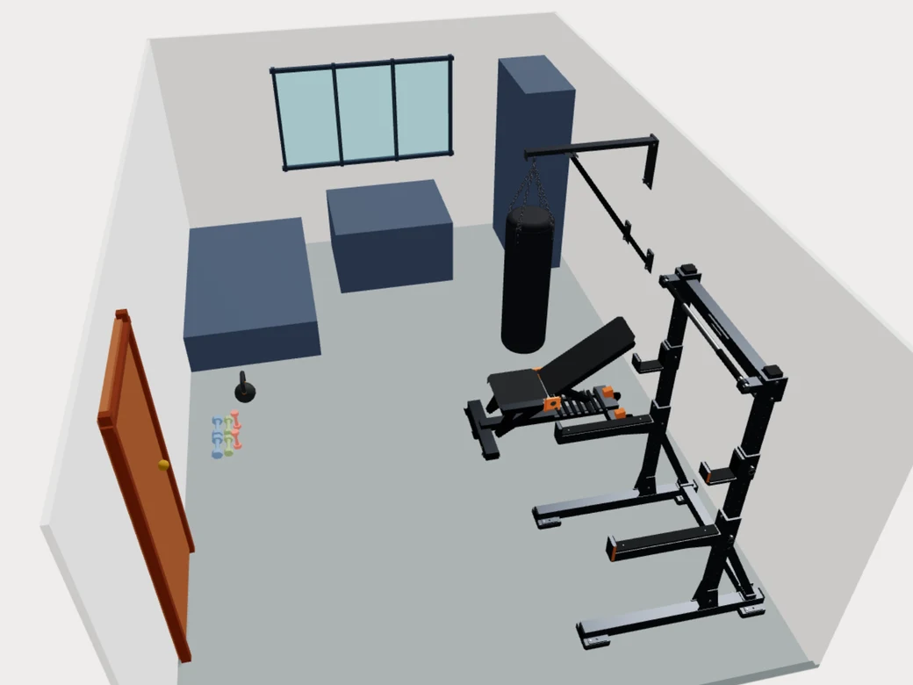

# Home Gym Creator

Home Gym Creator is a WebMCP-first room planner where a person and an AI agent design the
same home gym in the same interface. Both use the same domain commands, deterministic geometry,
validation, project store, and undo/redo history.

**Live demo:** [home-gym-coral.vercel.app](https://home-gym-coral.vercel.app/)

**Try the prepared project:**
[home-gym-coral.vercel.app/creator?start=demo](https://home-gym-coral.vercel.app/creator?start=demo)

Built for the [WebMCP Challenge](https://webmcp.devpost.com/). All products and brands in the
catalog are fictional.

## The problem

Planning a home gym is a spatial problem, not just a shopping problem. Equipment has to fit around
walls, doors, furniture, exercise clearance, training goals, and a budget. A chat-only assistant can
suggest products, but it cannot reliably inspect or update the user's current layout.

Home Gym Creator exposes the open page and its live room state through WebMCP. The user can edit the
room manually, ask an agent to continue from those changes, inspect the visible result, undo an agent
operation, and keep refining the same project.

## Product captures

| Room model and obstacles | Equipment arranged in the same room |
| --- | --- |
|  |  |

These are captures of the running prototype, not design mockups. The arranged-room image does not
claim that every visible placement passes validation; the application reports geometry and access
results separately.

## What a person and an agent can do together

1. The person describes the room, goals, budget, and immovable obstacles.
2. The agent reads the current project and searches the fictional equipment catalog.
3. The agent proposes or applies placements through WebMCP.
4. The application deterministically checks collisions, bounds, clearance zones, ceiling height,
   access, goal coverage, and budget.
5. The person moves or locks an item manually.
6. The agent reads that new state and adapts the rest of the layout.
7. Both can inspect the same shopping list and project summary; every changed mutation shares one
   undo/redo history.

The agent interprets goals and validation results. It does not replace the geometry engine or decide
that an invalid layout is acceptable.

## Main features

- editable 3D room with a precise 2D view and fallback;
- room dimensions, physical obstacles, unavailable floor zones, doors, and windows;
- 24 fictional products with dimensions, prices, exercises, goals, and placement requirements;
- manual and agent-driven equipment selection, placement, movement, rotation, and locking;
- deterministic collision, bounds, use-zone, reachability, height, and budget validation;
- deterministic placement suggestions and atomic multi-change evaluation/application;
- shared undo/redo for manual and WebMCP changes;
- local save/restore plus canonical JSON import/export;
- shopping list, cost, goal coverage, validation results, and a read-only project summary.

## WebMCP implementation

Each route registers tools on the client after its required state is ready. Registration uses the
imperative API through `document.modelContext.registerTool(...)`. Tool inputs are validated at
runtime with Zod-compatible JSON Schemas. Mutations call the same project commands used by the UI
and return structured results containing the resulting state, revision, validation, and readable
errors.

The app exposes 26 route-scoped tool registrations with 22 unique names. Shared read tools are
intentionally available on more than one surface.

### Creator — 21 tools

| Tool | Purpose |
| --- | --- |
| `get_project_summary` | Read the deterministic summary shown by the application. |
| `get_project_state` | Read the live room, settings, items, placements, validation, and history state. |
| `configure_room` | Set room width, depth, and height. |
| `update_project_settings` | Update budget and training goals. |
| `add_obstacle` | Add a physical obstacle or explicit unavailable floor zone. |
| `update_obstacle` | Edit or unlock an existing obstacle or unavailable zone. |
| `remove_obstacle` | Remove an unlocked obstacle or unavailable zone. |
| `add_wall_element` | Add a door or window to a wall. |
| `update_wall_element` | Edit an existing door or window. |
| `remove_wall_element` | Remove a door or window. |
| `validate_layout` | Read deterministic validation without changing the project. |
| `search_products` | Search the catalog by query, dimensions, price, category, goal, and requirements. |
| `place_product` | Buy and place a catalog product in one undoable operation. |
| `add_product_to_project` | Add a product to the shopping list without placing it. |
| `place_project_item` | Place an existing unplaced project item. |
| `update_placement` | Move, rotate, lock, or unlock placed equipment. |
| `unplace_product` | Remove equipment from the room while keeping it on the shopping list. |
| `remove_product` | Remove a project item and its placement. |
| `suggest_placements` | Generate deterministic placement candidates without mutation. |
| `evaluate_layout_changes` | Preview an ordered batch of changes in memory. |
| `apply_layout_changes` | Validate and apply a batch atomically as one undo step. |

### Catalog — 2 read-only tools

| Tool | Purpose |
| --- | --- |
| `search_products` | Search the same fictional catalog shown in the UI. |
| `get_product_details` | Read complete commercial, spatial, and training data for one product. |

### Summary — 3 read-only tools

| Tool | Purpose |
| --- | --- |
| `get_project_summary` | Read the same cost, goals, checks, recommendations, and floor figures shown on the page. |
| `get_project_state` | Read the locally saved project represented by the summary. |
| `validate_layout` | Read the summary project's deterministic validation. |

The concrete registration adapter is in
[`src/features/webmcp/register-tool-set.ts`](src/features/webmcp/register-tool-set.ts), with
route tool sets in [`src/features/webmcp`](src/features/webmcp).

## Demo prompts

Open the [prepared project](https://home-gym-coral.vercel.app/creator?start=demo) in a WebMCP-capable
browser and try:

> Read the current project. Summarize the room, locked obstacles, equipment, budget, and layout
> issues. Do not change anything yet.

Then make a manual change in the editor and continue:

> Read the project again and identify what changed. Keep my manual placement, find a suitable cardio
> product within the remaining budget, evaluate the required changes, and apply them only if the
> final layout has no validation errors. Explain any warnings.

To demonstrate shared history:

> Move one unlocked item to a valid placement and tell me the resulting revision and validation
> counts. I will undo the change manually afterward.

On the catalog route:

> Find strength equipment under $1,000 that fits within 140 × 140 cm. Compare the footprints and
> required exercise space of the best options.

On the summary route:

> Read the project summary and verify the displayed total cost, placement status, training-goal
> coverage, and validation result. Do not modify the project.

## Testing WebMCP

WebMCP is experimental, so verify current browser support and setup against the linked official
documentation before judging or recording a demo.

### ChatGPT or Codex in-app browser

1. Start a fresh agent session with a WebMCP-capable model.
2. Open the [live application](https://home-gym-coral.vercel.app/) in the in-app browser.
3. Navigate to the desired surface: `/catalog`, `/creator?start=demo`, or `/summary`.
4. Ask the agent to discover the tools exposed by the currently open page.
5. Run a read-only prompt first, then a mutation on the creator route.
6. Confirm that the visible UI changes in the same page and that manual undo reverses the agent
   change.

### Google Chrome

1. Install a Chrome version that supports WebMCP.
2. Open `chrome://flags/#enable-webmcp-testing`.
3. Set the WebMCP testing flag to **Enabled** and restart Chrome.
4. Open the live application on its HTTPS origin.
5. Inspect the registered tools, input schemas, structured responses, and error cases.
6. Repeat the shared-editing flow in a fresh browser profile or cleared site session.

The exact browser and host versions used for the submitted build must be recorded after final live
acceptance. See [`docs/WEBMCP_SOURCES.md`](docs/WEBMCP_SOURCES.md) for dated implementation notes,
official documentation links, and runtime caveats.

## Architecture

```text
Next.js routes and React UI
        │
        ├── manual interactions ──┐
        │                         ▼
        └── WebMCP tool handlers → shared project commands → Zustand project store
                                                   │
                                                   ├── undo/redo history
                                                   ├── deterministic geometry and validation
                                                   ├── local persistence and JSON codec
                                                   └── summary and structured tool results
```

Important boundaries:

- [`src/features/project`](src/features/project) owns schemas, commands, validation, suggestions,
  serialization, and deterministic project derivations.
- [`src/features/geometry`](src/features/geometry) owns spatial calculations and has no agent or UI
  decision-making.
- [`src/features/creator`](src/features/creator) owns the shared store, persistence, 2D/3D editing,
  and manual interaction adapters.
- [`src/features/webmcp`](src/features/webmcp) validates tool arguments and adapts them to the same
  project commands.
- [`src/features/summary`](src/features/summary) renders the same deterministic summary exposed to
  the agent.

The full design and command flow are documented in
[`docs/TECHNICAL_ARCHITECTURE.md`](docs/TECHNICAL_ARCHITECTURE.md).

## Routes

| Route | Purpose |
| --- | --- |
| `/` | Landing page and agent setup guide. |
| `/catalog` | Searchable fictional equipment catalog. |
| `/catalog/[slug]` | Product details and planning entry. |
| `/creator` | Resume the project saved in this browser. |
| `/creator?start=demo` | Open the prepared room and equipment scenario. |
| `/creator?start=new` | Start an empty project. |
| `/summary` | Read-only summary of the locally saved project. |

Explicit demo/new starts ask before replacing an existing saved project. A fresh session starts
directly; refreshing after edits restores those edits instead of resetting the room.

## Local development

### Requirements

- Node.js 20 or newer
- npm

### Install and run

```bash
npm install
npm run dev
```

Open [http://localhost:3000](http://localhost:3000).

### Validation commands

```bash
npm run test             # Vitest test suite
npm run quality:quick    # lint errors, TypeScript, file-size guard, duplicate detection
npm run agent:verify     # canonical local gate, including all tests
npm run build            # production Next.js build
```

## Persistence and prototype limits

- Projects are stored in one browser-local `localStorage` slot; there is no account, cloud sync,
  backend project database, or shareable project URL.
- JSON import/export is the portable project format.
- Undo/redo is shared within the active editor session; it is not persisted across navigation.
- The room is rectangular and the geometry is intentionally simplified.
- Photo interpretation happens in the external multimodal agent; the app does not perform automatic
  image reconstruction.
- The catalog is fictional, prices are illustrative, and there is no checkout.
- This is not professional CAD, construction guidance, or a safety assessment.

## Assets and licensing

The catalog, names, product data, screenshots, generated geometric models, and project graphics are
part of this repository. The two README images above are real application captures supplied for the
project and distributed with the repository. Their processing and provenance are documented in
[`docs/LANDING_ASSETS.md`](docs/LANDING_ASSETS.md).

The separate landing-page hero is explicitly labeled as an AI-generated concept and is not used in
this README as evidence of application output. Dependency licenses remain governed by their
respective packages.

This project is released under the [MIT License](LICENSE).

## Project documentation

- [Product concept](docs/PRODUCT_CONCEPT.md)
- [Technical architecture](docs/TECHNICAL_ARCHITECTURE.md)
- [WebMCP sources and runtime notes](docs/WEBMCP_SOURCES.md)
- [Hackathon requirements](docs/HACKATHON_REQUIREMENTS.md)
- [Landing-page specification](docs/LANDING_PAGE.md)
- [Editor specification](docs/EDITOR_MOCKUP.md)
