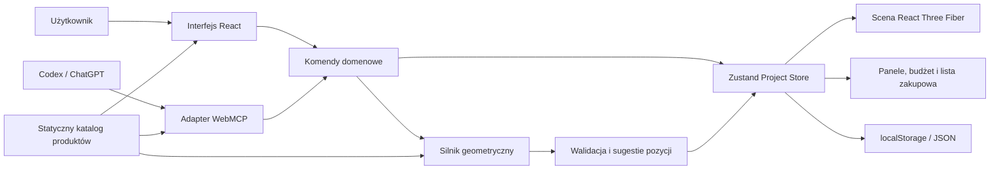
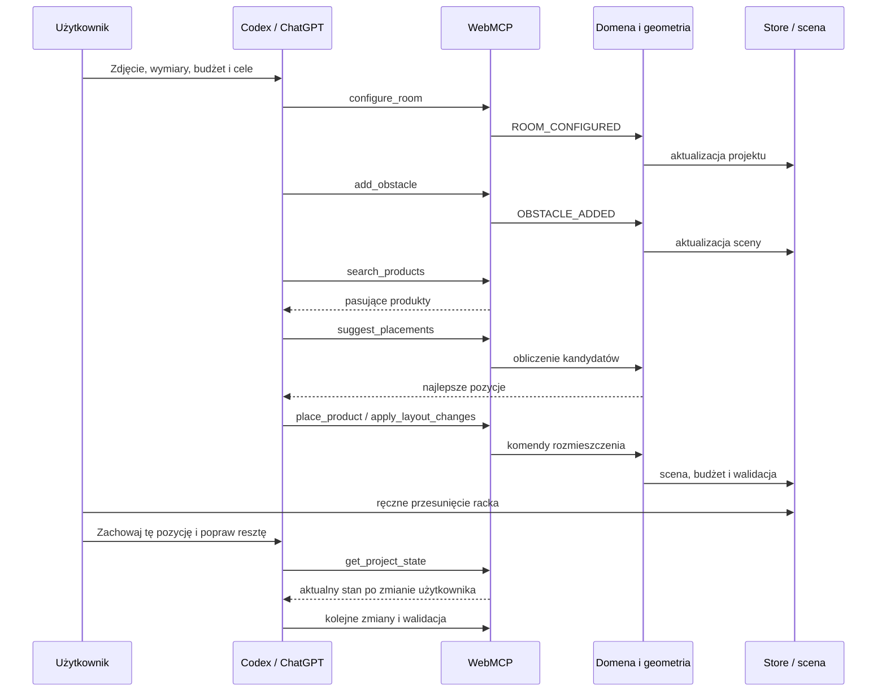

# Home Gym Creator — architektura techniczna

> Status: zaakceptowana architektura bazowa.  
> Data decyzji: 27 sierpnia 2026.  
> Dokument będzie aktualizowany w trakcie implementacji, jeżeli testy WebMCP lub ograniczenia czasowe wymuszą zmianę zakresu.

## 1. Cele architektury

Architektura powinna umożliwić zbudowanie kompletnego MVP w krótkim czasie i jednocześnie wyraźnie pokazać wartość WebMCP.

Najważniejsze cele:

- jeden wspólny stan projektu dla użytkownika i agenta,
- jedna logika domenowa obsługująca operacje UI oraz WebMCP,
- deterministyczna geometria i walidacja,
- prosty, responsywny edytor 2.5D/3D,
- statyczny katalog fikcyjnych produktów,
- działanie bez konta, bazy danych i własnego modelu AI,
- łatwe wdrożenie i testowanie w ChatGPT/Codex oraz Chrome,
- możliwość późniejszego dodania persystencji serwerowej bez przebudowy domeny.

## 2. Zaakceptowany stack

| Obszar | Technologia | Rola |
|---|---|---|
| Framework | Next.js App Router | Routing, strony, rendering i deployment |
| Język | TypeScript | Typy domenowe, geometria, UI i WebMCP |
| UI | React, Tailwind CSS, shadcn/ui | Interfejs sklepu i kreatora |
| Renderowanie 3D | Three.js, React Three Fiber, Drei | Scena, kamery i interakcje przestrzenne |
| Stan klienta | Zustand | Wspólny store projektu i edytora |
| Schematy | Zod | Walidacja runtime, typy i JSON Schema |
| Testy jednostkowe | Vitest | Geometria, komendy i walidacja |
| Testy komponentów | React Testing Library | Formularze i panele UI |
| Testy E2E | Playwright | Pełne przepływy użytkownika |
| Dane produktów | Statyczne JSON/TypeScript | Fikcyjny katalog MVP |
| Persystencja MVP | localStorage + import/export JSON | Zapisywanie bez backendu |
| Hosting | Vercel | Publiczne środowisko demonstracyjne |

Dokładne wersje zależności zostaną zablokowane podczas inicjalizacji projektu. W szczególności trzeba zachować zgodność głównej wersji React z React Three Fiber.

## 3. Ogólny model architektury



Najważniejszą regułą jest brak osobnej logiki modyfikacji projektu dla agenta. UI i WebMCP wywołują te same komendy domenowe.

## 4. Next.js i granica server/client

Next.js App Router będzie obsługiwać część sklepową oraz wejście do kreatora.

Planowane ścieżki:

```text
/                  landing page
/catalog           katalog produktów
/catalog/[slug]    szczegóły produktu
/creator           kreator siłowni
```

### Server Components

Server Components będą używane dla:

- landing page,
- pełnego katalogu,
- stron produktów,
- metadanych i SEO,
- wczytania oraz walidacji statycznych danych produktowych,
- przekazania serializowalnego katalogu do kreatora.

### Client Components

Client Components będą używane dla:

- całego interaktywnego studia,
- sceny WebGL,
- stanu Zustand,
- formularzy edycji projektu,
- drag-and-drop i obsługi pointera,
- localStorage,
- importu i eksportu JSON,
- rejestracji `document.modelContext`.

Scena React Three Fiber powinna być załadowana dynamicznie po stronie klienta, ponieważ używa WebGL i API przeglądarki.

Katalog będzie miał osobne strony, ale w `/creator` znajdzie się również panel wyszukiwania produktów. Agent nie powinien opuszczać kreatora w trakcie głównego scenariusza, ponieważ narzędzia WebMCP są związane z aktualnie otwartą stroną.

## 5. Struktura modułów

```text
src/
├── app/
│   ├── layout.tsx
│   ├── page.tsx
│   ├── catalog/
│   │   ├── page.tsx
│   │   └── [slug]/page.tsx
│   └── creator/
│       └── page.tsx
├── components/
│   └── ui/
├── data/
│   └── products/
│       ├── racks.json
│       ├── benches.json
│       ├── cardio.json
│       ├── weights.json
│       └── accessories.json
├── features/
│   ├── catalog/
│   │   ├── components/
│   │   ├── queries/
│   │   └── schemas/
│   ├── creator/
│   │   ├── components/
│   │   ├── scene/
│   │   ├── store/
│   │   └── persistence/
│   ├── geometry/
│   │   ├── collision.ts
│   │   ├── clearance.ts
│   │   ├── placement.ts
│   │   └── scoring.ts
│   ├── project/
│   │   ├── commands/
│   │   ├── schemas/
│   │   ├── types/
│   │   └── validation/
│   └── webmcp/
│       ├── register-tools.ts
│       ├── tool-handlers.ts
│       ├── tool-schemas.ts
│       └── tool-results.ts
└── lib/
```

Warstwa `geometry` i większość `project` nie mogą importować Reacta, Zustand ani Three.js. Powinny pozostać czystym TypeScriptem możliwym do przetestowania bez DOM.

## 6. Model domenowy

Wszystkie wymiary w domenie będą przechowywane jako całkowite liczby centymetrów. Renderowanie może przeliczać je na jednostki sceny.

```ts
type Dimensions3D = {
  widthCm: number;
  depthCm: number;
  heightCm: number;
};

type Position2D = {
  xCm: number;
  zCm: number;
};

type Rotation = 0 | 90 | 180 | 270;

type Room = {
  widthCm: number;
  depthCm: number;
  heightCm: number;
};

type Obstacle = {
  id: string;
  name: string;
  position: Position2D;
  dimensions: Dimensions3D;
  rotation: Rotation;
  locked: boolean;
};

type ProductClearance = {
  frontCm: number;
  backCm: number;
  leftCm: number;
  rightCm: number;
};

type Product = {
  id: string;
  slug: string;
  name: string;
  category: string;
  price: number;
  dimensions: Dimensions3D;
  clearance: ProductClearance;
  exercises: string[];
  trainingGoals: string[];
  requirements: {
    minimumCeilingHeightCm?: number;
    anchoring?: boolean;
  };
};

type Placement = {
  id: string;
  productId: string;
  position: Position2D;
  rotation: Rotation;
};

type GymProject = {
  version: number;
  room: Room;
  obstacles: Obstacle[];
  placements: Placement[];
  budget: number;
  trainingGoals: string[];
};
```

Współrzędne domenowe rozpoczynają się w jednym rogu pokoju. Renderer odpowiada za przeliczenie ich na układ sceny wycentrowany w Three.js.

Pole `version` umożliwi późniejszą migrację zapisanych projektów.

## 7. Store i komendy domenowe

Zustand przechowuje aktualny projekt, zaznaczenie, wynik walidacji i historię zmian.

```ts
type ProjectStore = {
  project: GymProject;
  selectedEntityId: string | null;
  validation: ValidationIssue[];
  history: ProjectHistory;

  dispatch: (command: ProjectCommand) => CommandResult;
  undo: () => void;
  redo: () => void;
  resetDemo: () => void;
};
```

Przykładowe komendy:

```ts
type ProjectCommand =
  | { type: "ROOM_CONFIGURED"; payload: Room }
  | { type: "OBSTACLE_ADDED"; payload: Obstacle }
  | { type: "OBSTACLE_UPDATED"; payload: UpdateObstacleInput }
  | { type: "OBSTACLE_REMOVED"; payload: { obstacleId: string } }
  | { type: "PRODUCT_PLACED"; payload: Placement }
  | { type: "PLACEMENT_MOVED"; payload: MovePlacementInput }
  | { type: "PLACEMENT_REMOVED"; payload: { placementId: string } }
  | { type: "LAYOUT_CHANGES_APPLIED"; payload: LayoutChange[] };
```

Przebieg komendy:

1. walidacja wejścia,
2. sprawdzenie warunków wstępnych,
3. wykonanie zmiany,
4. ponowna walidacja układu,
5. aktualizacja store,
6. zapis w historii,
7. zwrócenie ustrukturyzowanego rezultatu.

UI oraz WebMCP mogą przygotowywać inne obiekty wejściowe, ale finalnie muszą używać tego samego `dispatch`.

### Undo/redo

Historia umożliwi cofnięcie zarówno ręcznych zmian, jak i operacji agenta. Dla MVP można przechowywać ograniczoną liczbę snapshotów projektu, na przykład 30–50 stanów.

## 8. Silnik geometryczny

Silnik geometryczny będzie czystym TypeScriptem.

MVP obsługuje:

- prostokątny pokój,
- prostokątne przeszkody,
- prostokątne footprinty sprzętu,
- obrót co 90 stopni,
- oddzielne strefy fizyczne i robocze,
- minimalną wysokość sufitu,
- prostokątne strefy niedostępne, np. otwieranie drzwi.

Przy takich ograniczeniach kolizje można sprawdzać jako przecięcia prostokątów AABB po uwzględnieniu rotacji.

### Walidacja

```ts
type ValidationIssueCode =
  | "OUTSIDE_ROOM"
  | "PHYSICAL_COLLISION"
  | "CLEARANCE_COLLISION"
  | "CEILING_TOO_LOW"
  | "BUDGET_EXCEEDED";

type ValidationIssue = {
  code: ValidationIssueCode;
  severity: "error" | "warning";
  entityIds: string[];
  message: string;
};
```

Rozróżniamy:

- fizyczną kolizję — dwa obiekty rzeczywiście się przecinają,
- konflikt stref roboczych — obiekt mieści się, ale może być trudno go używać,
- ostrzeżenie budżetowe lub wysokościowe.

Silnik zwraca kody oraz dane, a warstwa prezentacji tworzy komunikaty dla użytkownika i agenta.

## 9. Sugestie rozmieszczenia

Agent nie powinien samodzielnie zgadywać wszystkich współrzędnych. Aplikacja udostępni deterministyczną funkcję `suggestPlacements`.

Proponowany algorytm MVP:

1. wygenerowanie punktów na siatce, np. co 10 cm,
2. sprawdzenie rotacji `0`, `90`, `180`, `270`,
3. odrzucenie pozycji wychodzących poza pokój,
4. odrzucenie fizycznych kolizji,
5. ocena konfliktów stref roboczych,
6. przyznanie punktów za ustawienie przy ścianie i zachowanie wolnego centrum,
7. zwrócenie kilku najlepszych kandydatów.

```ts
type PlacementCandidate = {
  position: Position2D;
  rotation: Rotation;
  score: number;
  warnings: ValidationIssue[];
  reasons: string[];
};
```

Nie budujemy w MVP globalnego solvera optymalizującego wszystkie produkty jednocześnie. Agent będzie iteracyjnie wybierał produkty, pobierał kandydatów, umieszczał je i ponownie walidował projekt.

## 10. Scena React Three Fiber

Jedna scena będzie obsługiwać dwa widoki:

- kamera ortograficzna — plan z góry,
- kamera perspektywiczna — prosty podgląd 3D.

Nie tworzymy osobnego edytora 2D i osobnego renderera 3D. Oba tryby korzystają z tych samych obiektów sceny i tego samego store.

Podstawowe elementy sceny:

- podłoga i ściany,
- siatka co 10 cm,
- przeszkody jako prostopadłościany,
- sprzęt jako uproszczone bryły,
- półprzezroczyste strefy robocze,
- obrys zaznaczonego elementu,
- czerwone oznaczenie kolizji,
- etykiety i podstawowe wymiary.

Interakcje:

- wybór obiektu kliknięciem,
- przeciąganie po płaszczyźnie podłogi,
- snapowanie do siatki,
- obrót co 90 stopni,
- blokowanie przeszkód,
- przełączanie trybu kamery,
- pokazanie lub ukrycie stref roboczych.

Realistyczne modele GLTF są opcjonalnym ulepszeniem. Walidacja zawsze korzysta z uproszczonego footprintu, a nie z geometrii renderowanego modelu.

## 11. Katalog produktów

Katalog MVP będzie statyczny i będzie zawierał około 30–50 fikcyjnych produktów.

Kategorie początkowe:

- racks,
- benches,
- barbells,
- plates,
- dumbbells,
- cardio,
- accessories,
- flooring.

Każdy rekord zostanie zwalidowany przez Zod podczas developmentu lub builda.

Katalog musi umożliwiać filtrowanie po:

- kategorii,
- cenie,
- wymiarach,
- celu treningowym,
- ćwiczeniach,
- wymaganej wysokości,
- wymaganiach montażowych.

Nie implementujemy w MVP prawdziwych stanów magazynowych, zewnętrznych cen, checkoutu ani panelu administracyjnego.

## 12. Zod i JSON Schema

Zod będzie pojedynczym źródłem prawdy dla:

- modeli wejściowych komend,
- argumentów narzędzi WebMCP,
- walidacji importowanych projektów,
- walidacji katalogu,
- inferencji typów TypeScript,
- generowania JSON Schema przez `z.toJSONSchema()`.

```ts
const PlaceProductInputSchema = z.object({
  productId: z.string().min(1),
  xCm: z.number().int().nonnegative(),
  zCm: z.number().int().nonnegative(),
  rotation: z.union([
    z.literal(0),
    z.literal(90),
    z.literal(180),
    z.literal(270)
  ])
});
```

Należy używać konstrukcji Zod, które mają jednoznaczny odpowiednik w JSON Schema. Argumenty narzędzia zawsze przechodzą również walidację runtime; samo przekazanie `inputSchema` agentowi nie zastępuje walidacji aplikacji.

## 13. Integracja WebMCP

WebMCP jest rejestrowane wyłącznie po stronie klienta po uruchomieniu kreatora.

```text
src/features/webmcp/
├── register-tools.ts
├── tool-handlers.ts
├── tool-schemas.ts
└── tool-results.ts
```

Adapter sprawdza dostępność API i rejestruje narzędzia z obsługą cleanupu.

```ts
useEffect(() => {
  if (typeof document.modelContext?.registerTool !== "function") return;

  const controller = new AbortController();

  registerProjectTools({
    signal: controller.signal,
    getState: projectStore.getState,
    dispatch: projectStore.getState().dispatch
  });

  return () => controller.abort();
}, []);
```

Handlery muszą pobierać aktualny stan w momencie wykonania. Nie mogą pracować na kopii projektu zamkniętej w nieaktualnym closure.

### Planowany zestaw narzędzi read-only

- `get_project_state`
- `search_products`
- `get_product_details`
- `validate_layout`
- `suggest_placements`
- `get_project_summary`

### Planowany zestaw narzędzi modyfikujących

- `configure_room`
- `add_obstacle`
- `update_obstacle`
- `remove_obstacle`
- `place_product`
- `update_placement`
- `remove_product`
- `apply_layout_changes`

Każdy handler:

1. waliduje argumenty przez Zod,
2. wywołuje logikę katalogu lub komendę domenową,
3. ponownie waliduje projekt,
4. zwraca wynik operacji i najważniejszy fragment nowego stanu,
5. informuje o ostrzeżeniach oraz możliwych następnych krokach.

Narzędzia odczytujące otrzymują `readOnlyHint`. Opisy narzędzi muszą jasno rozróżniać odczyt, propozycję i wykonanie zmiany.

## 14. Przepływ głównego scenariusza



## 15. Zdjęcie pokoju

MVP nie będzie posiadać własnego uploadu analizowanego przez backend aplikacji.

Przepływ:

```text
zdjęcie → Codex/ChatGPT → interpretacja → argumenty JSON → WebMCP → projekt
```

Agent analizuje zdjęcie i prosi użytkownika o wymiar referencyjny. Następnie wywołuje `configure_room` i operacje przeszkód.

Korzyści:

- brak własnego klucza OpenAI API,
- brak przechowywania zdjęć,
- brak kosztów inference w aplikacji,
- mniejsza liczba elementów do wdrożenia,
- silniejsze pokazanie roli WebMCP.

Bezpośredni upload i analiza obrazu przez backend mogą zostać dodane po hackathonie.

## 16. Persystencja MVP

Projekt działa local-first.

Funkcje:

- automatyczny zapis do localStorage,
- wersjonowany format projektu,
- eksport do pliku JSON,
- import z pliku JSON,
- reset do projektu demonstracyjnego,
- kilka gotowych presetów pomieszczeń.

Nie implementujemy kont użytkowników ani synchronizacji w chmurze.

Potencjalne rozszerzenie po MVP:

```text
Client Component
      ↓
Next.js Route Handler
      ↓
Postgres / Neon
      ↓
/project/[shareId]
```

Warstwa domenowa nie może zależeć od localStorage, aby późniejsze dodanie repozytorium serwerowego było proste.

## 17. Bezpieczeństwo WebMCP

Projekt powinien:

- walidować wszystkie argumenty narzędzi,
- używać `readOnlyHint` dla operacji bez efektów ubocznych,
- nie wykonywać operacji spoza aktualnego projektu,
- zwracać rezultat pozwalający zweryfikować zmianę,
- nie ufać tekstowi pochodzącemu z danych zewnętrznych,
- umożliwiać cofnięcie operacji agenta,
- unikać nieodwracalnych zmian,
- rejestrować tylko narzędzia potrzebne w bieżącym kontekście,
- czyścić rejestrację podczas odmontowania kreatora.

Publiczne wdrożenie musi zostać przetestowane pod kątem:

- origin isolation,
- `document.domain`,
- Permissions Policy `tools`,
- origin trial Chrome,
- zachowania w top-level document,
- działania po odświeżeniu i bezpośrednim wejściu na `/creator`.

Nie należy dodawać nagłówków bezpieczeństwa na podstawie przypuszczeń. Konfigurację wdrożenia ustalamy po teście aktualnej wersji Chrome i hostingu.

## 18. Testowanie

### Vitest

- obracanie footprintów,
- granice pokoju,
- fizyczne kolizje,
- strefy robocze,
- wysokość sufitu,
- obliczanie budżetu,
- scoring kandydatów,
- komendy domenowe,
- undo/redo,
- import i migracja projektu.

### React Testing Library

- konfigurator pokoju,
- formularz przeszkody,
- filtry katalogu,
- panel właściwości,
- komunikaty walidacji,
- podsumowanie budżetu.

### Playwright

- wejście do kreatora,
- zmiana wymiarów,
- dodanie przeszkody,
- umieszczenie produktu,
- przeciągnięcie i obrót,
- zapis oraz odtworzenie stanu,
- przełączanie widoku,
- reset scenariusza demo.

### WebMCP

- jednostkowe testy każdego handlera,
- ręczne wywołanie narzędzi w Chrome,
- test nazw i opisów z agentem,
- test poprawnych i błędnych argumentów,
- test łańcucha odczyt → wyszukiwanie → mutacja → walidacja → poprawka,
- test w świeżej sesji ChatGPT/Codex,
- test w publicznym deploymentcie,
- zapis zestawu przykładowych promptów i oczekiwanych wywołań.

## 19. Deployment

Docelowym hostingiem MVP jest Vercel.

Deployment powinien posiadać:

- publiczny URL,
- brak wymaganej autoryzacji,
- gotowy projekt demonstracyjny,
- statyczne dane produktowe,
- poprawną obsługę bez localStorage,
- czytelny fallback, gdy WebMCP nie jest dostępne,
- brak sekretów i kluczy API.

Publiczny deployment należy uruchomić wcześnie, aby przetestować WebMCP przed zakończeniem prac nad UI.

## 20. Zakres poza MVP

Poza zaakceptowanym zakresem znajdują się:

- konta użytkowników,
- baza danych,
- synchronizacja projektów,
- prawdziwe sklepy i ceny,
- checkout,
- własne wywołania modelu OpenAI,
- upload i analiza zdjęcia przez aplikację,
- nieregularne obrysy pokoi,
- dowolne kąty obrotu,
- realistyczna fizyka,
- fotorealistyczne modele wszystkich produktów,
- globalny solver optymalizujący cały układ,
- AR, LiDAR i skanowanie pomieszczeń.

## 21. Kolejność implementacji

1. inicjalizacja Next.js, TypeScript, Tailwind i testów,
2. modele Zod oraz statyczny katalog,
3. czysta domena projektu i komendy,
4. podstawowa geometria i walidacja,
5. Zustand store i undo/redo,
6. minimalna scena React Three Fiber,
7. ręczna edycja pokoju, przeszkód i rozmieszczeń,
8. katalog w panelu kreatora,
9. persystencja i reset demo,
10. podstawowe narzędzia WebMCP read-only,
11. narzędzia modyfikujące i batch changes,
12. sugestie rozmieszczenia,
13. pełny scenariusz agent–użytkownik,
14. testy E2E i WebMCP,
15. deployment oraz weryfikacja w ChatGPT i Chrome,
16. dopracowanie UX, filmu i submission.

## 22. Źródła techniczne

- [Next.js App Router](https://nextjs.org/docs/app)
- [Next.js Server and Client Components](https://nextjs.org/docs/app/getting-started/server-and-client-components)
- [React Three Fiber](https://r3f.docs.pmnd.rs/getting-started/installation)
- [Zustand](https://zustand.docs.pmnd.rs/learn/getting-started/introduction.html)
- [Zod JSON Schema](https://zod.dev/json-schema)
- [OpenAI Docs — Site tools](https://learn.chatgpt.com/docs/webmcp)
- [Chrome WebMCP](https://developer.chrome.com/docs/ai/webmcp)
- [Chrome Imperative API](https://developer.chrome.com/docs/ai/webmcp/imperative-api)
- [Chrome WebMCP evals](https://developer.chrome.com/docs/ai/webmcp/evals)
- [WebMCP specification](https://webmachinelearning.github.io/webmcp/)

## 23. Powiązane dokumenty

- [Koncepcja produktu](./PRODUCT_CONCEPT.md)
- [Wymagania hackathonu](./HACKATHON_REQUIREMENTS.md)
- [Źródła WebMCP](./WEBMCP_SOURCES.md)
