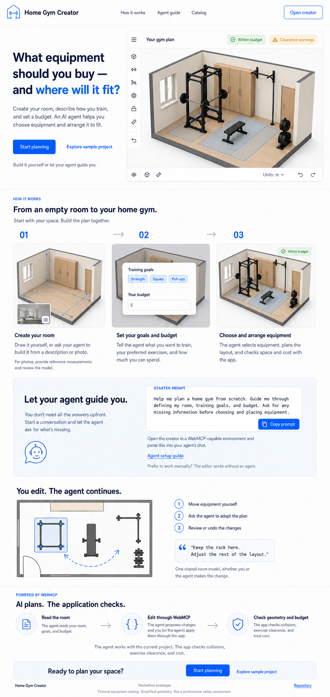

# Home Gym Creator — landing page

> Accepted direction: 30 August 2026. Process-first hackathon introduction, not a sales page or
> a walkthrough of the bundled demo. [Implemented and locally verified](PHASE_23A_LANDING_VERIFICATION.md).

## Visual reference

[Reference provenance and generation brief](./mockups/home-gym-landing-page-v2.md).
The reference establishes layout, hierarchy and style; this specification governs behavior and copy.
Generated editor views, controls and status labels are illustrative, not implementation evidence.
The earlier v1 reference is historical and is not the implementation target.

## Page goal

Explain the real problem: choosing equipment for a user's exercises, arranging it in their available
room with obstacles and exercise clearance, and keeping the complete set within budget.
Explain the process from scratch, then show why shared editing with an agent improves it.
The prepared demo is an optional shortcut to a result, not the narrative of the page.

Use English throughout. Keep the existing light slate/white surfaces, navy text, blue actions,
green budget indicators and amber warnings. Avoid sales sections, pricing plans, testimonials,
fake endorsements and a dominant catalog presentation.

## Page structure and copy

### 1. Hero

Headline:

> What equipment should you buy — and where will it fit?

Description:

> Create your room, describe how you train, and set a budget. An AI agent helps you choose equipment
> and arrange it to fit.

Primary CTA: **Start planning**. Secondary CTA: **Explore sample project**.
Supporting line: **Build it yourself or let your agent guide you.**

Use a real primary-3D editor capture as the result preview. Retain visible, truthful warnings rather
than depicting a universally valid or safety-certified plan. No separate sample statistics strip,
prescribed room dimensions, equipment count, fixed budget or demo scenario section.

### 2. How it works

Anchor: `how-it-works`. Heading: **From an empty room to your home gym.**
Subline: **Start with your space. Build the plan together.**

1. **Create your room** — Draw it yourself, or ask your agent to build it from a description or photo.
   Note: For photos, provide reference measurements and review the model.
2. **Set your goals and budget** — Tell the agent what you want to train, your preferred exercises,
   and how much you can spend.
3. **Choose and arrange equipment** — The agent selects equipment, plans the layout, and checks
   space and cost with the app.

Illustrate the same room and fixed obstacle across all three steps: empty geometry, goals/budget,
then furnished layout with clearance visualization. Use captures/crops of real product states;
editorial labels may explain them, but must not invent controls. Do not copy the mockup's dollar
symbol into the PLN-based product. This is a conceptual sequence, not a new mandatory wizard.

A photo goes to the external agent; do not imply built-in photo upload or accurate automatic
reconstruction. The agent can gather several inputs in one exchange or ask for missing ones.

### 3. Agent guide

Anchor: `agent-guide`. Heading: **Let your agent guide you.**

> You don't need all the answers upfront. Start a conversation and let the agent ask for what's missing.

Always-visible, selectable starter prompt with a **Copy prompt** button:

> Help me plan a home gym from scratch. Guide me through defining my room, training goals, and budget.
> Ask for any missing information before choosing and placing equipment.

Instructions:

> Open the creator in a WebMCP-capable environment and paste this into your agent's chat.

Provide a short inline **Agent setup guide** disclosure here (no separate route). Describe copying
the prompt, opening **Start planning**, and using the external agent on that same creator page/session.
Include concise, freshly verified environment setup guidance with official source links. Do not
hard-code unverified browser/model versions or imply tools register on `/`.
There is no in-app chatbot or automatic agent launch.

Manual alternative: **Prefer to work manually? The editor works without an agent.**
Copying must not navigate or start a project. Announce success accessibly only when copying succeeds;
on failure or an unavailable Clipboard API, keep the prompt selectable and explain manual copying.

### 4. Shared editing

Heading: **You edit. The agent continues.**

- Move equipment yourself.
- Ask the agent to adapt the plan.
- Review or undo the changes.

Example follow-up: **Keep the rack here. Adjust the rest of the layout.**
Caption: **One shared room model, whether you or the agent makes the change.**
Use a real editor capture with a selected item; any added directional cue is explanatory artwork,
not a claim that an activity feed or path visualization exists in the product.

### 5. WebMCP explanation

Eyebrow: **Powered by WebMCP**. Heading: **AI plans. The application checks.**

**Read the room → Edit through WebMCP → Check geometry and budget**

> The agent works with the current project. The app checks collisions, exercise clearance, and cost.

Agent tools apply changes to the same model as manual editing, with shared undo/redo. Do not copy
the generated mockup's inaccurate claim that a separate user must apply proposed agent changes.
The deterministic engine checks geometry; the agent interprets results and trade-offs.

### 6. Closing actions and footer

Heading: **Ready to plan your space?**
Primary **Start planning**; secondary **Explore sample project**.
Reuse the shared footer with prototype identification and a verified public **Repository** link.
The implementation omits that link while the configured URL returns logged-out HTTP 404;
confirm public access before adding it. This remains a release gate, not a placeholder link.
Note: **Fictional equipment catalog. Simplified geometry. Not a professional safety assessment.**
No fabricated demo-video link or extra promotional section.

## Navigation and destinations

| Element | Destination |
| --- | --- |
| Start planning | `/creator?start=new` |
| Explore sample project | `/creator?start=demo` |
| Open creator | `/creator` |
| How it works | `/#how-it-works` |
| Agent guide | `/#agent-guide` |
| Catalog | `/catalog` |
| Logo | `/` |

Header order: How it works, Agent guide, Catalog, then the existing Open creator action.
The inline Agent setup guide opens its local disclosure; it is not another empty anchor.
Anchor targets must stay visible below the sticky header. At narrow widths keep in-page paths to
both guidance sections available even if the shared desktop navigation is hidden.

Start parameters retain their existing one-shot semantics. Explicit `new` and `demo` actions replace
the current project; generic `/creator` resumes it. Refresh restores edits after the start parameter
has been consumed. Do not silently change persistence or introduce a new onboarding route.
Before implementing entry copy, verify the existing new-project configuration panel and guide the
user honestly; do not imply the agent bypasses setup if it cannot.

## Responsive and implementation principles

- Hero text then preview on phones; two columns on desktop.
- Process steps stack in 01–02–03 order on phones and form one row on desktop.
- Prompt and instructions remain readable and selectable without horizontal scrolling.
- Keep static content server-rendered; isolate copying as a small client interaction.
- Use existing primitives/tokens; no new layout library, WebGL scene or agent runtime on the landing.
- Production images need dimensions, responsive sizing, descriptive alt text and provenance.
- The approved full-page mockup is documentation, never the shipped page or hero image.
