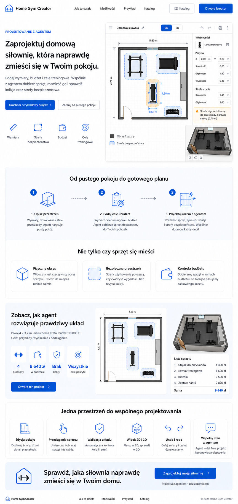

# Home Gym Creator — landing page

## Mockup

## Page goal

The landing page should primarily lead the user into the creator, not the product catalog.

Main product promise:

> Design a home gym that will actually fit in your room.

The page should quickly show the project's differentiator: a user and an agent working together on a layout that accounts for room dimensions, obstacles, clearance zones, training goals, and budget.

## Page structure

### 1. Hero

Headline:

> Design a home gym that will actually fit in your room.

Description:

> Enter dimensions, budget, and training goals. Together with an agent, choose equipment, place it, and check collisions and clearance zones.

Primary actions:

- **Launch sample project** — the main CTA, sending the user into a ready-made demo scenario.
- **Start from an empty room** — a secondary CTA for a user who wants to create their own project.

Beside the copy, show a creator mockup, ideally a 2D plan with visible clearance zones and a spatial-constraint warning.

### 2. How it works

Present the process in three steps:

1. **Describe the space** — enter dimensions, obstacles, doors, and ceiling height.
2. **Set goals and budget** — specify planned exercises, preferences, and a maximum cost.
3. **Design together with an agent** — the agent selects and places equipment, and the user can correct the design by hand.

### 3. Key differentiator

The landing page should explain that the project analyzes all of the following at once:

- whether the equipment physically fits in the room,
- whether enough space remains for safe exercise,
- whether the selected set stays within budget.

This section matters more than an expanded catalog presentation.

### 4. Sample scenario

Show a concrete case on the page:

> A 4 × 3.2 m room, a fixed wardrobe, and a PLN 10,000 budget. Goals: squats, bench press, and pull-ups.

Example result summary:

- 4 selected products,
- cost PLN 9,640,
- all training goals covered,
- no collisions,
- deadlift zone preserved.

Section CTA: **Open this project**.

### 5. Creator capabilities

A short presentation of the most important features:

- room and obstacle editing,
- dragging and rotating equipment,
- automatic layout validation,
- clearance-zone visualization,
- 2D and 3D views,
- user and agent collaborating on the same project.

### 6. Closing CTA

Message:

> You already have a room. Now see what gym will actually fit in it.

Button: **Design my gym**.

## Navigation and destinations

| Element | Destination |
| --- | --- |
| Launch sample project | `/creator?start=demo` |
| Start from an empty room | `/creator?start=new` |
| Open this project | `/creator?start=demo` |
| Design my gym | `/creator?start=new` |
| Open creator | `/creator?start=new` |
| Browse equipment | `/catalog` |
| Specific product card | `/catalog/[slug]` |
| Logo | `/` |

The exact way of passing the start mode may change during implementation. What matters is preserving two intents:

- `demo` loads a ready-made room and sample layout so the app's capabilities are visible immediately,
- `new` opens an empty project with a short configuration panel: dimensions, goals, and budget.

## Flow rules

- The primary navigation CTA should read **Open creator**.
- The catalog is a secondary path and should not dominate the main scenario.
- New-project configuration happens in a panel inside `/creator`, not on separate onboarding pages.
- The user should reach shared work with the agent in one click from the hero.
- The landing page sells the end result and collaboration with an agent; the catalog only supplies elements for the design.
