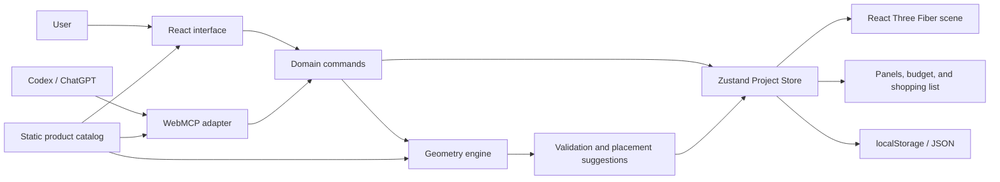
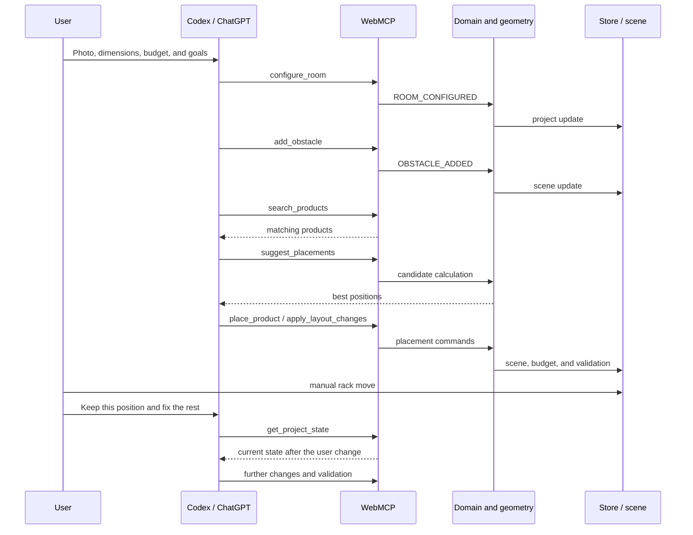

# Home Gym Creator — technical architecture

> Status: accepted baseline architecture.  
> Decision date: 27 August 2026.  
> This document will be updated during implementation if WebMCP tests or time constraints force a scope change.

## 1. Architecture goals

The architecture should make it possible to build a complete MVP in a short time and clearly demonstrate the value of WebMCP.

The most important goals:

- one shared project state for the user and the agent,
- one domain layer serving both UI and WebMCP operations,
- deterministic geometry and validation,
- a simple, responsive 2.5D/3D editor,
- a static catalog of fictional products,
- operation without accounts, a database, or a custom AI model,
- easy deployment and testing in ChatGPT/Codex and Chrome,
- the ability to add server-side persistence later without rebuilding the domain.

## 2. Accepted stack

| Area | Technology | Role |
|---|---|---|
| Framework | Next.js App Router | Routing, pages, rendering, and deployment |
| Language | TypeScript | Domain types, geometry, UI, and WebMCP |
| UI | React, Tailwind CSS, shadcn/ui | Store and creator interface |
| 3D rendering | Three.js, React Three Fiber, Drei | Scene, cameras, and spatial interactions |
| Client state | Zustand | Shared project and editor store |
| Schemas | Zod | Runtime validation, types, and JSON Schema |
| Unit tests | Vitest | Geometry, commands, and validation |
| Component tests | React Testing Library | Forms and UI panels |
| E2E tests | Playwright | Full user flows |
| Product data | Static JSON/TypeScript | Fictional MVP catalog |
| MVP persistence | localStorage + JSON import/export | Saving without a backend |
| Hosting | Vercel | Public demo environment |

Exact dependency versions will be locked during project initialization. In particular, the major React version must stay compatible with React Three Fiber.

## 3. Overall architecture model



The most important rule is that there is no separate project-mutation logic for the agent. The UI and WebMCP call the same domain commands.

## 4. Next.js and the server/client boundary

The Next.js App Router will handle the store-like pages and the entry into the creator.

Planned routes:

```text
/                  landing page
/catalog           product catalog
/catalog/[slug]    product details
/creator           gym creator
```

### Server Components

Server Components will be used for:

- the landing page,
- the full catalog,
- product pages,
- metadata and SEO,
- loading and validating static product data,
- passing a serializable catalog into the creator.

### Client Components

Client Components will be used for:

- the entire interactive studio,
- the WebGL scene,
- Zustand state,
- project-editing forms,
- drag-and-drop and pointer handling,
- localStorage,
- JSON import and export,
- `document.modelContext` registration.

The React Three Fiber scene should be loaded dynamically on the client, because it uses WebGL and browser APIs.

The catalog will have its own pages, but `/creator` will also include a product-search panel. The agent should not leave the creator during the main scenario, because WebMCP tools are bound to the currently open page.

## 5. Module structure

```text
src/
├── app/
│   ├── layout.tsx
│   ├── page.tsx
│   ├── catalog/
│   │   ├── page.tsx
│   │   └── [slug]/page.tsx
│   └── creator/
│       └── page.tsx
├── components/
│   └── ui/
├── data/
│   └── products/
│       ├── products.ts
│       ├── racks.ts
│       ├── benches.ts
│       ├── barbells.ts
│       ├── plates.ts
│       ├── dumbbells.ts
│       ├── cardio.ts
│       └── accessories.ts
├── features/
│   ├── catalog/
│   │   ├── components/
│   │   ├── queries/
│   │   └── schemas/
│   ├── creator/
│   │   ├── components/
│   │   ├── scene/
│   │   ├── store/
│   │   └── persistence/
│   ├── geometry/
│   │   ├── collision.ts
│   │   ├── clearance.ts
│   │   ├── placement.ts
│   │   └── scoring.ts
│   ├── project/
│   │   ├── commands/
│   │   ├── schemas/
│   │   ├── types/
│   │   └── validation/
│   └── webmcp/
│       ├── register-tools.ts
│       ├── tool-handlers.ts
│       ├── tool-schemas.ts
│       └── tool-results.ts
└── lib/
```

The `geometry` layer and most of `project` must not import React, Zustand, or Three.js. They should remain pure TypeScript that can be tested without the DOM.

## 6. Domain model

All domain dimensions will be stored as integer centimeters. Rendering may convert them into scene units.

```ts
type Dimensions3D = {
  widthCm: number;
  depthCm: number;
  heightCm: number;
};

type Position2D = {
  xCm: number;
  zCm: number;
};

type Rotation = 0 | 90 | 180 | 270;

type Room = {
  widthCm: number;
  depthCm: number;
  heightCm: number;
};

type PhysicalObstacle = {
  id: string;
  kind: "obstacle";
  name: string;
  position: Position2D;
  dimensions: Dimensions3D;
  rotation: Rotation;
  locked: boolean;
};

type UnavailableZone = {
  id: string;
  kind: "unavailable-zone";
  name: string;
  position: Position2D;
  dimensions: {
    widthCm: number;
    depthCm: number;
  };
  rotation: Rotation;
  locked: boolean;
};

type Obstacle = PhysicalObstacle | UnavailableZone;

type Wall = "top" | "right" | "bottom" | "left";

type WallElement = {
  id: string;
  kind: "door" | "window";
  name: string;
  wall: Wall;
  offsetCm: number;
  widthCm: number;
};

type ProductClearance = {
  frontCm: number;
  backCm: number;
  leftCm: number;
  rightCm: number;
};

type Product = {
  id: string;
  slug: string;
  name: string;
  category: string;
  price: number;
  placementMode: "floor" | "selection-only";
  dimensions: Dimensions3D;
  clearance: ProductClearance;
  exercises: string[];
  trainingGoals: string[];
  requirements: {
    minimumCeilingHeightCm?: number;
    anchoring?: "recommended" | "required";
  };
};

type ProjectItem = {
  id: string;
  productId: string;
};

type Placement = {
  id: string;
  projectItemId: string;
  position: Position2D;
  rotation: Rotation;
};

type GymProject = {
  version: number;
  room: Room;
  obstacles: Obstacle[];
  wallElements: WallElement[];
  projectItems: ProjectItem[];
  placements: Placement[];
  budget: number;
  trainingGoals: string[];
};
```

Domain coordinates start in one corner of the room. The renderer is responsible for converting them into the Three.js scene coordinate system, which is centered.

The `version` field will allow later migration of saved projects.

`offsetCm` is measured left-to-right on horizontal walls and top-to-bottom on vertical walls. Doors and windows deliberately have no hinge side, opening direction, swing arc, sill height, opening height, or derived unavailable zone in this MVP phase. They are validated against their wall and neighboring wall elements, but they do not participate in floor collision checks.

## 7. Store and domain commands

Zustand holds the current project, selection, validation result, and change history.

```ts
type ProjectStore = {
  project: GymProject;
  selectedEntityId: string | null;
  validation: ValidationIssue[];
  history: ProjectHistory;

  dispatch: (command: ProjectCommand) => CommandResult;
  undo: () => void;
  redo: () => void;
  resetDemo: () => void;
};
```

Example commands:

```ts
type ProjectCommand =
  | { type: "ROOM_CONFIGURED"; payload: Room }
  | { type: "OBSTACLE_ADDED"; payload: Obstacle }
  | { type: "OBSTACLE_UPDATED"; payload: UpdateObstacleInput }
  | { type: "OBSTACLE_REMOVED"; payload: { obstacleId: string } }
  | { type: "WALL_ELEMENT_ADDED"; payload: WallElement }
  | { type: "WALL_ELEMENT_UPDATED"; payload: UpdateWallElementInput }
  | { type: "WALL_ELEMENT_REMOVED"; payload: { wallElementId: string } }
  | { type: "PROJECT_ITEM_ADDED"; payload: { productId: string } }
  | { type: "PROJECT_ITEM_REMOVED"; payload: { projectItemId: string } }
  | { type: "PROJECT_ITEM_PLACED"; payload: PlaceProjectItemInput }
  | { type: "PRODUCT_PLACED"; payload: PlaceProductInput }
  | { type: "PLACEMENT_UPDATED"; payload: UpdatePlacementInput }
  | { type: "PLACEMENT_REMOVED"; payload: { placementId: string } }
  | { type: "LAYOUT_CHANGES_APPLIED"; payload: LayoutChange[] };
```

Command flow:

1. validate input,
2. check preconditions,
3. apply the change,
4. re-validate the layout,
5. update the store,
6. record history,
7. return a structured result.

The UI and WebMCP may prepare different input objects, but they must ultimately use the same `dispatch`.

The active palette tool is transient editor state, not project state. The manual placement flow is **palette → plan → inspector**: choose one of the four tools, create the element with one valid plan interaction and one domain command, then edit the selected entity in the inspector. WebMCP mutations call the same commands and therefore share validation, history, persistence, and observable state with manual edits.

### Undo/redo

History will allow undoing both manual changes and agent operations. For the MVP, a limited number of project snapshots can be stored, for example 30–50 states.

## 8. Geometry engine

The geometry engine will be pure TypeScript.

The MVP supports:

- a rectangular room,
- rectangular physical obstacles with height,
- rectangular 2D unavailable zones,
- wall-bound doors and windows that do not block the floor,
- rectangular equipment footprints,
- rotation in 90-degree steps,
- separate physical and working zones,
- a minimum ceiling height.

With these constraints, collisions can be checked as AABB rectangle intersections after rotation is applied.

### Validation

```ts
type ValidationIssueCode =
  | "OUTSIDE_ROOM"
  | "PHYSICAL_COLLISION"
  | "CLEARANCE_COLLISION"
  | "CEILING_TOO_LOW"
  | "BUDGET_EXCEEDED";

type ValidationIssue = {
  code: ValidationIssueCode;
  severity: "error" | "warning";
  entityIds: string[];
  message: string;
};
```

We distinguish:

- a physical collision — two objects actually intersect,
- a working-zone conflict — the object fits, but may be hard to use,
- a budget or height warning.

The engine returns codes and data, and the presentation layer creates messages for the user and the agent.

## 9. Placement suggestions

The agent should not guess all coordinates on its own. The application will expose a deterministic `suggestPlacements` function.

Implemented MVP algorithm (`src/features/project/suggestions/`):

1. generate origin-aligned 10 cm grid positions in ascending Z, X, then rotation
   `0`, `90`, `180`, `270`, filtered by optional rotations and inclusive region bounds;
2. apply each candidate through the shared pure domain command with deterministic injected IDs;
3. reject every layout with an error or any unreachable access fact, including obstacles whose
   global issue severity remains a warning;
4. score warnings using `CANDIDATE_WARNING_WEIGHTS`: unevaluated access 1, use-zone overlap 10,
   tight access 25 (unreachable obstacles are always rejected, regardless of their weight);
5. sort by integer score, then generation index, returning 3 suggestions by default, at most 10.

The request identifies exactly one `productId` or `projectItemId`. Existing placed items are moved
in memory rather than duplicated. Each suggestion includes its exact command, pose, warning counts
and warnings. Results include generated/rejected counts and rejection reasons, including an
explained empty list when nothing fits. No suggestion is applied automatically.
The current pose is also a candidate for an existing placement: if it is already a best fit,
applying that suggestion is a no-op rather than forcing an unnecessary move.

Searches are bounded to 20,000 candidates. Rooms with doors also require at most 20,000 access-grid
cells and 30 million candidate-cell evaluations. Oversized requests fail explicitly with advice to
narrow the region or rotations; they are never silently truncated. No door means access was not
evaluated, not that the layout is known to be reachable.

```ts
type PlacementCandidate = {
  position: Position2D;
  rotation: Rotation;
  score: number;
  warnings: ValidationIssue[];
  warningCounts: Record<string, number>;
  command: ProjectCommand;
};
```

We will not build a global solver that optimizes all products at once in the MVP. The agent will iteratively choose products, fetch candidates, place them, and re-validate the project.

### Atomic layout changes

`evaluate_layout_changes` and `apply_layout_changes` share a strict `{ changes: ProjectCommand[] }`
schema accepting 1–25 ordered commands. `applyProjectCommands` folds them in memory and returns
the final analysis, merged affected IDs and per-change outcomes, or the failing zero-based index
and original command error. Intermediate invalid layouts are permitted; no intermediate state is
published. `dispatchBatch` rejects final errors and unreachable facts using the same scoring policy,
then records one history snapshot and one revision increment. Warnings may remain on success.
Rejected and net-unchanged batches do not change history. Existing single-command dispatch is unchanged.

The store's read-only `previewBatch` and `suggestPlacements` use the same injected product resolver
and analyzer as mutations. Preview IDs are temporary and do not consume the real ID generators;
commands should reference existing canonical IDs, not guessed IDs for entities created in the batch.
Evaluation reports hypothetical validation and error/warning deltas without changing project,
revision, undo/redo or autosave. Application rechecks the live state rather than trusting a preview.

## 10. 2D plan and React Three Fiber scene

The creator uses two presentation adapters:

- the existing SVG `RoomPlan` for precise top-down editing;
- a default editable React Three Fiber scene with a perspective camera.

They do not share renderer objects. They share one `GymProject`, one Zustand store, the same catalog
dimensions, and the same deterministic geometry and validation rules. The 3D adapter receives the
project, visible selection and validation issues as props from the editor, without a renderer-specific store. The input controller subscribes to revisions solely to invalidate drafts. Switching view is
transient UI state and does not affect project revision, history, persistence, or WebMCP.

Basic scene elements:

- floor and walls,
- a 10 cm grid,
- obstacles as cuboids,
- unavailable zones as flat floor overlays,
- minimal door and window marks on walls,
- equipment as AI-generated procedural GLB families with simplified-solid fallbacks,
- translucent working zones,
- selected-element outline,
- red collision marking,
- labels and basic dimensions.

Phase 27 replaces the read-only shell with editable 3D. `CreatorEditor` retains the store and
bridge above both views and supplies callbacks plus its store API to the scene adapter.
`create-room-element-command.ts` and existing equipment builders are shared by both renderers.

`SceneEditController` is renderer-independent: it owns pointer identity, revision, movement
threshold, capture cleanup and a transient command draft. `use-scene-editing` connects its snapshot
to React, subscribes to synchronous store revisions, and cleans up global cancellation listeners.
Any committed external revision cancels drafts; release rechecks the live revision and builders
re-resolve the entity before dispatch. One changed gesture is one normal domain command. No
preview project, autosave or separate agent mutation path is introduced.

`ScenePicking` builds a camera ray from DOM coordinates and intersects only catalog/domain-sized
boxes, independently of the visual scene graph. DOM pointer capture deliberately avoids Fiber's
additive mesh-capture propagation. `scene-targeting` projects onto the floor plane and applies the
inverse centred-metres conversion. `scene-move-command` preserves grab offsets and snapping;
mounted movement is projected onto the retained wall axis before mounting constraints. Door and
window offsets are snapped/clamped along their existing wall. Command-aligned ghosts display
footprints/use zones without claiming the draft has passed validation.

Contextual pointer-down arbitration replaces the Edit/Navigate toggle. The controller captures
placement and already-selected entity gestures; the DOM capture handler stops them before the
native camera listener. Other gestures reach OrbitControls and retain only a click candidate:
short click selects/clears, drag navigates without selection or project mutation. Ownership cannot
change when a pointer crosses another entity; selection changes cancel pending gestures. Fit/top
camera presets do not run on ordinary revisions. Camera-relative wall cutaway keeps both side
walls near frontal views: hide the nearer side after 25° of horizontal rotation, restore below
20° (hysteresis), symmetrically around all four axes. Top-down retains its separate thresholds;
floor edges, openings, mounted equipment and placement targets remain independent of visual wall
visibility. Native lists/inspector controls and keyboard centre placement provide an alternative
to pointer interaction. Switching views clears incomplete work, not project selection/history.

Selection appears as an additive amber envelope outline. Validation uses the same
`entityIssueState` helper as 2D: errors take precedence over warnings and tint use zones, fallback
solids, obstacles and wall markers without modifying GLB materials. Only currently placed assets
are preloaded; a failed model keeps its fallback, outline and use zone. `SceneBoundary` wraps the
whole Canvas and `SceneContextLoss` listens for context loss; both offer recovery to the same
project in 2D. Neither failure remounts persistence or the WebMCP bridge.

See [Phase 27 verification](PHASE_27_3D_EDITOR_VERIFICATION.md) for observed browser coverage and
remaining device/deployment acceptance; unit/controller tests are not claims of GPU validation.

Phase 28 separates the compact project header from `CreatorViewportToolbar`, which owns the
visible view/history/camera controls outside the lazy scene. Camera preset requests are transient
parent state; the scene cancels any gesture before applying them. `fitSceneCamera` solves distance
from the eight room corners projected against horizontal and vertical frustum slopes, leaving
6% edge margins. It runs on mount or an explicit preset, not on project revisions. `SiteChrome`
hides marketing chrome only at `/creator`; sidebar tabs and popover disclosure state are local UI
state, with no domain/schema changes. See [Phase 28 verification](PHASE_28_WORKSPACE_VERIFICATION.md).

The primary equipment visuals are reproducible, AI-generated procedural GLB assets produced
offline and mapped by visual family. They remain simplified presentation assets rather than
photorealistic product twins. Missing assets fall back to deterministic solids, and validation
always uses the catalog footprint rather than rendered mesh geometry.

Visual assets face negative Z in their source GLB and raw top-view SVG. Domain `frontCm` points
toward positive Z at rotation 0, then negative X, negative Z, and positive X at 90/180/270.
The shared presentation adapter converts domain rotation to GLB yaw `180 - rotation` (modulo 360);
SVG applies the inverse angle. Asset orientation must not change catalog clearances or stored poses.

## 11. Product catalog

The active MVP catalog is static and contains 23 fictional products: 21 placeable products with
photos/models and two shopping-list-only accessories. Seventeen products were removed
at the user's request. Their frozen specifications live separately in `src/data/products/retired/`
only to interpret existing saved projects. Active search, detail queries and product routes exclude
them. Project-specific lookups retain names, costs and geometry; the shared command layer rejects
new purchases/direct placements of retired products but allows editing or removing legacy items.

Wall mounting and floor blockage are independent product facts. Mounted products can opt into
`mounting.blocksFloor: true` to reserve their entire physical footprint for collision and walking
access checks, even when suspended above the floor (the Wall-Mounted Punching Bag). Omitted or
false retains the existing elevated-bar behavior. Mount height still governs visuals, ceiling and
wall-opening checks; UI and WebMCP use the same validation path.

Signal Resistance Bands and Groundwork Foam Roller are active shopping-list-only
products. They count toward cost and training coverage but cannot be placed in the room.
Signal bands changed from floor placement after user clarification. Creator ingress reconciles
legacy Signal placements into existing unplaced shopping items before catalog validation, keeping
item IDs, quantities and unrelated project data. Other invalid or unknown products still fail
validation. Local restore does not write until a normal user edit; import is one undoable change.

Active MVP categories:

- racks,
- benches,
- barbells,
- plates,
- dumbbells,
- cardio,
- accessories.

Flooring is deferred. Treating floor products as placeable would require layered surfaces and
overlap exceptions that are outside the current deterministic placement model.

Each record will be validated by Zod during development or build.

The catalog must support filtering by:

- category,
- price,
- dimensions,
- training goal,
- exercises,
- required height,
- anchoring requirements (`none`, `recommended`, or `required`, where an omitted product value
  means `none`).

We will not implement real stock, external prices, checkout, or an admin panel in the MVP.

## 12. Zod and JSON Schema

Zod will be the single source of truth for:

- command input models,
- WebMCP tool arguments,
- imported-project validation,
- catalog validation,
- TypeScript type inference,
- JSON Schema generation via `z.toJSONSchema()`.

```ts
const PlaceProductInputSchema = z.object({
  productId: z.string().min(1),
  xCm: z.number().int().nonnegative(),
  zCm: z.number().int().nonnegative(),
  rotation: z.union([
    z.literal(0),
    z.literal(90),
    z.literal(180),
    z.literal(270)
  ])
});
```

Use Zod constructs that have an unambiguous JSON Schema equivalent. Tool arguments always also go through runtime validation; handing `inputSchema` to the agent does not replace application validation.

## 13. WebMCP integration

WebMCP is registered only on the client after the creator is running.

```text
src/features/webmcp/
├── register-tools.ts
├── tool-handlers.ts
├── tool-schemas.ts
└── tool-results.ts
```

The adapter checks API availability and registers tools with cleanup handling.

```ts
useEffect(() => {
  if (typeof document.modelContext?.registerTool !== "function") return;

  const controller = new AbortController();

  registerProjectTools({
    signal: controller.signal,
    getState: projectStore.getState,
    dispatch: projectStore.getState().dispatch
  });

  return () => controller.abort();
}, []);
```

Handlers must read the current state at execution time. They must not work on a project copy closed over in a stale closure.

### Planned read-only tool set

- `get_project_state`
- `search_products`
- `get_product_details`
- `validate_layout`
- `suggest_placements`
- `get_project_summary`

### Planned mutating tool set

- `configure_room`
- `update_project_settings`
- `add_obstacle`
- `update_obstacle`
- `remove_obstacle`
- `add_wall_element`
- `update_wall_element`
- `remove_wall_element`
- `place_product`
- `add_product_to_project`
- `place_project_item`
- `update_placement`
- `unplace_product`
- `remove_product`
- `apply_layout_changes`

The tool set is delivered in route-scoped phases. Phase 8 registers the initial room tools on
`/creator`: `get_project_state`, `validate_layout`, `configure_room`,
`update_project_settings`, `add_obstacle`, `update_obstacle`, and `remove_obstacle`. Phase 10
extends the same room-tool registration with `add_wall_element`, `update_wall_element`, and
`remove_wall_element`.
`configure_room` changes dimensions only; budget and training goals use the separate settings
command so every successful tool mutation creates at most one shared undo step. Catalog tools
remain scoped to `/catalog` until the complete creator tool set is composed in a later phase.

Wall-element tool descriptions and results use the same canonical wall and offset convention as the project schema. They make explicit that doors and windows do not generate unavailable zones and do not participate in floor collision validation.

Each handler:

1. validates arguments with Zod,
2. calls catalog logic or a domain command,
3. re-validates the project,
4. returns the operation result and the most important fragment of the new state,
5. reports warnings and possible next steps.

Read tools receive `readOnlyHint`. Tool descriptions must clearly distinguish reading, proposing, and applying a change.

Phase 21 extends the creator registration to 20 tools with read-only `suggest_placements` and
`evaluate_layout_changes`, plus mutating `apply_layout_changes`. They reuse the room-tool error,
validation, access-impact and mutation envelopes and the existing registration lifecycle.

## 14. Main scenario flow



## 15. Room photo

The MVP will not have its own upload analyzed by the application backend.

Flow:

```text
photo → Codex/ChatGPT → interpretation → JSON arguments → WebMCP → project
```

The agent analyzes the photo and asks the user for a reference measurement. It then calls `configure_room` and obstacle operations.

Benefits:

- no custom OpenAI API key,
- no photo storage,
- no inference cost in the application,
- fewer items to ship,
- a stronger demonstration of WebMCP's role.

Direct upload and image analysis by a backend can be added after the hackathon.

## 16. MVP persistence

The project is local-first.

Features:

- automatic save to localStorage,
- versioned project format,
- export to a JSON file,
- import from a JSON file,
- undoable reset to an empty project,
- one bundled validated demo and explicit new-project start actions,
- one-shot URL initialization; generic creator links and reload restore the current saved project.

See [Phase 26 behavior and verification](./PHASE_26_DEMO_VERIFICATION.md) for start,
URL cleanup and storage-failure semantics.

We will not implement user accounts or cloud sync.

Potential post-MVP extension:

```text
Client Component
      ↓
Next.js Route Handler
      ↓
Postgres / Neon
      ↓
/project/[shareId]
```

The domain layer must not depend on localStorage, so adding a server repository later stays simple.

## 17. WebMCP security

The project should:

- validate all tool arguments,
- use `readOnlyHint` for operations with no side effects,
- not perform operations outside the current project,
- return a result that makes the change verifiable,
- not trust text originating from external data,
- allow undoing agent operations,
- avoid irreversible changes,
- register only tools needed in the current context,
- clean up registration when the creator unmounts.

Public deployment must be tested for:

- origin isolation,
- `document.domain`,
- Permissions Policy `tools`,
- the Chrome origin trial,
- behavior in a top-level document,
- behavior after refresh and a direct visit to `/creator`.

Do not add security headers based on guesses. Deployment configuration is decided after testing the current Chrome version and hosting.

## 18. Testing

### Vitest

- footprint rotation,
- room bounds,
- physical collisions,
- working zones,
- ceiling height,
- budget calculation,
- candidate scoring,
- domain commands,
- undo/redo,
- project import and migration.

### React Testing Library

- room configurator,
- four-tool placement palette and selection inspector,
- catalog filters,
- properties panel,
- validation messages,
- budget summary.

### Playwright

- entering the creator,
- changing dimensions,
- adding an obstacle,
- adding an unavailable zone, door, and window directly from the plan,
- placing a product,
- dragging and rotating,
- saving and restoring state,
- switching views,
- resetting the demo scenario.

### WebMCP

- unit tests for each handler,
- manual tool calls in Chrome,
- testing names and descriptions with an agent,
- testing valid and invalid arguments,
- testing the read → search → mutate → validate → fix chain,
- testing in a fresh ChatGPT/Codex session,
- testing in the public deployment,
- recording a set of sample prompts and expected calls.

## 19. Deployment

The target MVP host is Vercel.

Deployment should have:

- a public URL,
- no required authorization,
- a ready-made demo project,
- static product data,
- correct handling without localStorage,
- a readable fallback when WebMCP is unavailable,
- no secrets or API keys.

Launch the public deployment early so WebMCP can be tested before UI work is finished.

## 20. Out of MVP scope

Outside the accepted scope:

- user accounts,
- a database,
- project sync,
- real stores and prices,
- checkout,
- custom OpenAI model calls,
- photo upload and analysis by the application,
- irregular room outlines,
- arbitrary rotation angles,
- realistic physics,
- photorealistic models of every product,
- a global solver that optimizes the entire layout,
- AR, LiDAR, and room scanning.

## 21. Implementation order

1. initialize Next.js, TypeScript, Tailwind, and tests,
2. Zod models and a static catalog,
3. a pure project domain and commands,
4. basic geometry and validation,
5. Zustand store and undo/redo,
6. a minimal React Three Fiber scene,
7. manual editing of the room, obstacles, and placements,
8. catalog in the creator panel,
9. persistence and demo reset,
10. basic read-only WebMCP tools,
11. mutating tools and batch changes,
12. placement suggestions,
13. the full agent–user scenario,
14. E2E and WebMCP tests,
15. deployment and verification in ChatGPT and Chrome,
16. polish UX, video, and submission.

## 22. Technical sources

- [Next.js App Router](https://nextjs.org/docs/app)
- [Next.js Server and Client Components](https://nextjs.org/docs/app/getting-started/server-and-client-components)
- [React Three Fiber](https://r3f.docs.pmnd.rs/getting-started/installation)
- [Zustand](https://zustand.docs.pmnd.rs/learn/getting-started/introduction.html)
- [Zod JSON Schema](https://zod.dev/json-schema)
- [OpenAI Docs — Site tools](https://learn.chatgpt.com/docs/webmcp)
- [Chrome WebMCP](https://developer.chrome.com/docs/ai/webmcp)
- [Chrome Imperative API](https://developer.chrome.com/docs/ai/webmcp/imperative-api)
- [Chrome WebMCP evals](https://developer.chrome.com/docs/ai/webmcp/evals)
- [WebMCP specification](https://webmachinelearning.github.io/webmcp/)

## 23. Related documents

- [Product concept](./PRODUCT_CONCEPT.md)
- [Hackathon requirements](./HACKATHON_REQUIREMENTS.md)
- [WebMCP sources](./WEBMCP_SOURCES.md)
