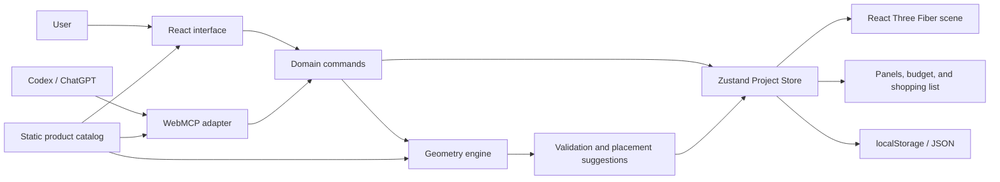
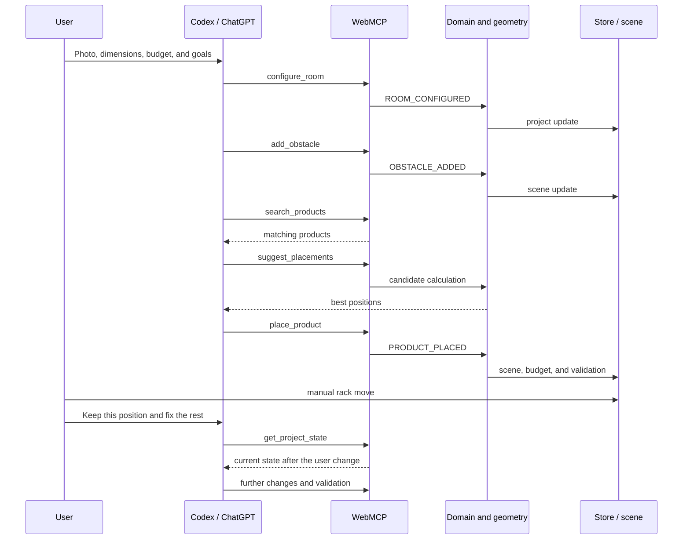

# Home Gym Creator — technical architecture

> Current implementation contracts, checked against local source on 30 August 2026.
> Public-build and device acceptance belong to the [submission plan](../plans/phase-28-submission.md).

## 1. Architecture goals

The architecture should make it possible to build a complete MVP in a short time and clearly demonstrate the value of WebMCP.

The most important goals:

- one shared project state for the user and the agent,
- one domain layer serving both UI and WebMCP operations,
- deterministic geometry and validation,
- a simple, responsive 2.5D/3D editor,
- a static catalog of fictional products,
- operation without accounts, a database, or a custom AI model,
- easy deployment and testing in ChatGPT/Codex and Chrome,
- the ability to add server-side persistence later without rebuilding the domain.

## 2. Accepted stack

| Area | Technology | Role |
|---|---|---|
| Framework | Next.js App Router | Routing, pages, rendering, and deployment |
| Language | TypeScript | Domain types, geometry, UI, and WebMCP |
| UI | React, Tailwind CSS, shared components | Catalog and creator interface |
| 3D rendering | Three.js, React Three Fiber, Drei | Scene, cameras, and spatial interactions |
| Client state | Zustand | Shared project and editor store |
| Schemas | Zod | Runtime validation, types, and JSON Schema |
| Unit tests | Vitest | Geometry, commands, and validation |
| Component tests | React Testing Library | Forms and UI panels |
| Browser acceptance | Separate local/public browser checks | Shared-editing and device flows; not part of Vitest |
| Product data | Static JSON/TypeScript | Fictional MVP catalog |
| MVP persistence | localStorage + JSON import/export | Saving without a backend |
| Hosting | Vercel | Public demo environment |

Exact versions are recorded in `package.json` and `package-lock.json`. React and React Three Fiber must remain compatible.

## 3. Overall architecture model



The most important rule is that there is no separate project-mutation logic for the agent. The UI and WebMCP call the same domain commands.

## 4. Next.js and the server/client boundary

The Next.js App Router handles catalog pages and the application entry points.

Implemented routes:

```text
/                  landing page
/catalog           product catalog
/catalog/[slug]    product details
/creator           gym creator
/summary           read-only, browser-local project summary
```

### Server Components

Server Components handle:

- the landing page,
- the full catalog,
- product pages,
- metadata and SEO,
- loading and validating static product data,
- passing a serializable catalog into the creator.

### Client Components

Client Components handle:

- the entire interactive studio,
- the WebGL scene,
- Zustand state,
- project-editing forms,
- drag-and-drop and pointer handling,
- localStorage,
- JSON import and export,
- `document.modelContext` registration.

The React Three Fiber scene loads dynamically on the client because it uses WebGL and browser APIs.

The catalog has its own pages; `/creator` includes a product-search panel. The agent should not leave the creator during the main scenario, because WebMCP tools are bound to the currently open page.

## 5. Module structure

| Source | Responsibility |
|---|---|
| [`src/app/`](../src/app/) | Landing, catalog, creator and summary routes |
| [`src/data/products/`](../src/data/products/) | Active catalog and frozen retired records |
| [`catalog/`](../src/features/catalog/) | Queries, schemas, cards and image mappings |
| [`creator/store/`](../src/features/creator/store/) | Shared project store, history and catalog reconciliation |
| [`creator/components/`](../src/features/creator/components/) | Manual editor, inspector and SVG plan |
| [`creator/scene/`](../src/features/creator/scene/) | 3D adapter, input sessions and asset registry |
| [`creator/persistence/`](../src/features/creator/persistence/) | Local restore/save, start actions and JSON export |
| [`geometry/`](../src/features/geometry/) | Footprints, mounting, reachability and exact floor union |
| [`project/`](../src/features/project/) | Schemas, commands, validation, suggestions, summary and serialization |
| [`summary/`](../src/features/summary/) | Read-only summary UI |
| [`webmcp/`](../src/features/webmcp/) | Route-specific registration, schemas, handlers and results |
| [`shared/`](../src/shared/) | Shared formatting and schema primitives |

The `geometry` layer and most of `project` must not import React, Zustand, or Three.js. They should remain pure TypeScript that can be tested without the DOM.

## 6. Domain model

All domain dimensions and positions use integer centimeters; rotations are 0/90/180/270 degrees.
The renderer converts them to centred scene units. The version-6 schema is defined in
[`project.ts`](../src/features/project/schemas/project.ts), with geometry primitives in
[`geometry.ts`](../src/features/project/schemas/geometry.ts).

A project contains a rectangular room, physical obstacles, unavailable zones, wall elements,
shopping items, placements, budget and training goals. Shopping items carry product identity;
placements refer to an item and add its pose and persistent `locked` boolean. Unplacing preserves the purchase; removing an
item removes its placement too. Physical obstacles have height, locking and required directional
`functionalClearance`; unavailable zones have a 2D footprint and never carry that field. Product
mounting and planning requirements come from the catalog.

Domain coordinates start in one corner of the room. The renderer is responsible for converting them into the Three.js scene coordinate system, which is centered.

The versioned codec migrates supported saved formats before project/catalog validation.
Version 5 adds placement locking. Version 6 adds obstacle functional clearance; the v5→v6
migration assigns four zero margins only to physical obstacles without changing any ID, pose,
dimension or lock. Earlier migrations continue through both steps. Exports preserve the canonical
version-6 state. A zero margin means “not specified”, not “verified safe”.

`offsetCm` is measured left-to-right on horizontal walls and top-to-bottom on vertical walls. Doors and windows deliberately have no hinge side, opening direction, swing arc, sill height, opening height, or derived unavailable zone in this MVP phase. They are validated against their wall and neighboring wall elements, but they do not participate in floor collision checks.

## 7. Store and domain commands

[`project-store.ts`](../src/features/creator/store/project-store.ts) holds the project,
analysis, revision and bounded undo/redo history. Selection, active tools and camera state are
transient editor UI state. The store exposes `dispatch`, `dispatchBatch`, read-only `previewBatch`
and `suggestPlacements`, plus validated project replacement and undo/redo.

The exact command union and runtime input contracts live in
[`project-command.ts`](../src/features/project/schemas/project-command.ts). Do not maintain a
second copied schema in documentation or give the agent a separate mutation path.

`PLACEMENT_UPDATED` also sets `locked`. While locked, the only permitted placement patch is
exactly `{ locked: false }`; mixed unlock-and-move patches are rejected with `ENTITY_LOCKED`.
Locked equipment cannot move, rotate, unplace or be deleted through `PROJECT_ITEM_REMOVED`.
UI controls and 2D/3D gestures respect the same guard. Explicit unlock followed by an edit may
be separate commands within an atomic batch; undo restores both. Suggestions for a locked target
return `ENTITY_LOCKED` before candidate generation and never unlock automatically. Other equipment
can still be planned around it. Room resizing does not move placements and remains available.
Whole-project import/reset and undo/redo remain explicit project-level operations, not equipment edits.

Command flow:

1. validate input,
2. check preconditions,
3. apply the change,
4. re-validate the layout,
5. update the store,
6. record history,
7. return a structured result.

The UI and WebMCP may prepare different input objects, but they must ultimately use the same `dispatch`.

The active palette tool is transient editor state, not project state. The manual placement flow is **palette → plan → inspector**: choose one of the four tools, create the element with one valid plan interaction and one domain command, then edit the selected entity in the inspector. WebMCP mutations call the same commands and therefore share validation, history, persistence, and observable state with manual edits.

### Undo/redo

History retains up to 50 project snapshots and covers both manual changes and agent operations.
Rejected/no-op commands do not add history. Undo history is editor-session-local, not persisted.

## 8. Geometry engine

The geometry engine is pure TypeScript.

The MVP supports:

- a rectangular room,
- rectangular physical obstacles with height,
- rectangular 2D unavailable zones,
- wall-bound doors and windows that do not block the floor,
- rectangular equipment footprints,
- rotation in 90-degree steps,
- separate physical and working zones,
- directional furniture functional-clearance zones using the same rotation mapping as equipment,
- a minimum ceiling height.

With these constraints, collisions can be checked as AABB rectangle intersections after rotation is applied.

### Validation

[`validation-issues.ts`](../src/features/project/validation/validation-issues.ts) defines the
structured codes, severity, entity IDs and details; shared descriptions serve UI and tool results.
Checks cover room/wall bounds, physical collisions, unavailable zones, use zones, height/mounting,
openings, budget and deterministic access from doors. No door means access was not evaluated.
Unavailable zones forbid equipment/use zones but remain walkable; they are not invented paths.
Access thresholds are application conventions, not building regulations or exercise-safety claims.

`FUNCTIONAL_ZONE_OVERLAP` records the zone owner, blocking entity and exact overlap bounds.
Equipment physical footprint inside furniture clearance is an error; equipment use-zone-only and
another obstacle's physical footprint are warnings. A physical collision is stronger and suppresses
the duplicate functional-zone issue for that entity pair. Functional clearance is an access target,
not an occupancy blocker: non-zero zones must be reachable from a door, while zero-clearance legacy
obstacles keep the expanded-physical access target.

A non-floor-blocking wall mount may physically project above furniture whose height is at or below
the mount's bottom edge without creating a physical collision. That exception applies only to the
wall-side physical projection: if the low obstacle enters any non-overlapping operational margin in
the equipment use zone, validation returns `USE_ZONE_OVERLAP` as an error. Equipment entering the
same mounted margin retains the existing warning policy. A height-reaching blocker, another wall
mount, an unavailable zone, or a mount with `blocksFloor` still produces the stronger collision or
zone-conflict issue without a duplicate use-zone issue.

Single commands may commit a spatially invalid layout and return its errors/warnings so a user or
agent can correct it. Batch application and suggestions use the stricter policy below. Physical,
height and budget errors must not be described as harmless warnings.

## 9. Placement suggestions

The agent should not guess all coordinates on its own. The application exposes a deterministic `suggestPlacements` function.

Implemented MVP algorithm (`src/features/project/suggestions/`):

1. resolve the product, then generate floor products on the origin-aligned 10 cm grid in ascending
   Z, X and rotation order; wall-mounted products instead scan a 10 cm grid only along each selected
   rotation's wall and snap the perpendicular coordinate exactly (`0` top, `90` right, `180` bottom,
   `270` left), including non-grid right/bottom origins such as `x=346` or `z=546`; optional regions
   must contain the final wall footprint rather than a rounded substitute;
2. apply each candidate through the shared pure domain command with deterministic injected IDs;
3. reject every layout with an error or any unreachable access fact, including obstacles whose
   global issue severity remains a warning;
4. score warnings using `CANDIDATE_WARNING_WEIGHTS`: unevaluated access 1, use-zone or functional-zone overlap 10,
   tight access 25 (unreachable obstacles are always rejected, regardless of their weight);
5. sort by integer score, then generation index, returning 3 suggestions by default, at most 10.

The request identifies exactly one `productId` or `projectItemId`. Existing placed items are moved
in memory rather than duplicated. Each suggestion includes its exact command, pose, warning counts
and warnings. Results include generated/rejected counts and rejection reasons, including an
explained empty list when nothing fits. No suggestion is applied automatically.
The current pose is also a candidate for an existing placement: if it is already a best fit,
applying that suggestion is a no-op rather than forcing an unnecessary move.

Searches are bounded to 20,000 actual generated candidates after wall/region filtering. Rooms with doors also require at most 20,000 access-grid
cells and 30 million candidate-cell evaluations. Oversized requests fail explicitly with advice to
narrow the region or rotations; they are never silently truncated. No door means access was not
evaluated, not that the layout is known to be reachable.

We will not build a global solver that optimizes all products at once in the MVP. The agent will iteratively choose products, fetch candidates, place them, and re-validate the project.

### Internal atomic layout changes

The domain store retains `previewBatch` and `dispatchBatch` for internal deterministic composition
and tests. They are not advertised as WebMCP tools: exposing the complete `ProjectCommand` union
duplicated every named mutation schema and made agent tool selection ambiguous. The MVP agent uses
the precise room, obstacle, opening, shopping and placement tools iteratively instead.

`applyProjectCommands` still folds 1–25 ordered commands in memory and returns final analysis,
affected IDs and per-change outcomes, or the failing index and command error. `dispatchBatch`
publishes only valid final state as one history snapshot; rejected and net-unchanged batches do not
change history. `suggestPlacements` continues to share the same resolver and analyzer.

## 10. 2D plan and React Three Fiber scene

The creator uses two presentation adapters:

- the existing SVG `RoomPlan` for precise top-down editing;
- a default editable React Three Fiber scene with a perspective camera.

They do not share renderer objects. They share one `GymProject`, one Zustand store, the same catalog
dimensions, and the same deterministic geometry and validation rules. The 3D adapter receives the
project, visible selection and validation issues as props from the editor, without a renderer-specific store. The input controller subscribes to revisions solely to invalidate drafts. Switching view is
transient UI state and does not affect project revision, history, persistence, or WebMCP.

Basic scene elements:

- floor and walls,
- a 10 cm grid,
- obstacles as cuboids,
- unavailable zones as flat floor overlays,
- minimal door and window marks on walls,
- equipment as AI-generated procedural GLB families with simplified-solid fallbacks,
- translucent working zones,
- selected-element outline,
- red collision marking,
- labels and basic dimensions.

`CreatorEditor` retains the store and
bridge above both views and supplies callbacks plus its store API to the scene adapter.
`create-room-element-command.ts` and existing equipment builders are shared by both renderers.

`SceneEditController` is renderer-independent: it owns pointer identity, revision, movement
threshold, capture cleanup and a transient command draft. `use-scene-editing` connects its snapshot
to React, subscribes to synchronous store revisions, and cleans up global cancellation listeners.
Any committed external revision cancels drafts; release rechecks the live revision and builders
re-resolve the entity before dispatch. One changed gesture is one normal domain command. No
preview project, autosave or separate agent mutation path is introduced.

`ScenePicking` builds a camera ray from DOM coordinates and intersects only catalog/domain-sized
boxes, independently of the visual scene graph. DOM pointer capture deliberately avoids Fiber's
additive mesh-capture propagation. `scene-targeting` projects onto the floor plane and applies the
inverse centred-metres conversion. `scene-move-command` preserves grab offsets and snapping;
mounted movement is projected onto the retained wall axis before mounting constraints. Door and
window offsets are snapped/clamped along their existing wall. Command-aligned ghosts display
footprints/use zones without claiming the draft has passed validation.

Contextual pointer-down arbitration replaces the Edit/Navigate toggle. The controller captures
placement and already-selected entity gestures; the DOM capture handler stops them before the
native camera listener. Other gestures reach OrbitControls and retain only a click candidate:
short click selects/clears, drag navigates without selection or project mutation. Ownership cannot
change when a pointer crosses another entity; selection changes cancel pending gestures. Fit/top
camera presets do not run on ordinary revisions. Camera-relative wall cutaway keeps both side
walls near frontal views: hide the nearer side after 25° of horizontal rotation, restore below
20° (hysteresis), symmetrically around all four axes. Top-down retains its separate thresholds;
floor-edge slabs remain when a wall is cut away and are omitted while that wall is shown, so the
two never share a volume. Presentation wall slabs sit entirely outside the room AABB so
flush-mounted equipment stays in the interior. Openings, mounted equipment and placement targets remain independent of
visual wall visibility. Native lists/inspector controls and keyboard centre placement provide an alternative
to pointer interaction. Switching views clears incomplete work, not project selection/history.

Selection appears as an additive amber envelope outline. Validation uses the same
`entityIssueState` helper as 2D: errors take precedence over warnings and tint use zones, fallback
solids, obstacles and wall markers without modifying GLB materials. Only currently placed assets
are preloaded; a failed model keeps its fallback, outline and applicable use zone. `SceneBoundary` wraps the
whole Canvas and `SceneContextLoss` listens for context loss; both offer recovery to the same
project in 2D. Neither failure remounts persistence or the WebMCP bridge.

Device/deployment acceptance is tracked in the [submission plan](../plans/phase-28-submission.md);
unit/controller tests are not claims of GPU validation.

The compact project header is separate from `CreatorViewportToolbar`, which owns the
visible view/history/camera controls outside the lazy scene. Camera preset requests are transient
parent state; the scene cancels any gesture before applying them. `fitSceneCamera` solves distance
and the lateral/up camera offsets from the eight projected room corners, centering their bounds
with 6% edge margins. Focus selected snapshots a `SceneBox` from `sceneSelectionBox`, using physical
equipment/catalog bounds, mounting height, areas or opening presentation envelopes. It retains the
current orbit direction and uses a 72% frame fraction. Unplaced purchases cannot be focused. Camera
fitting runs on mount or an explicit preset, not project revisions or selection changes; returning
from 2D resets to the room fit. `SiteChrome`
hides marketing chrome at `/creator` and `/summary`; sidebar tabs and popover disclosure state
are local UI state, with no domain/schema changes.

`SCENE_ROOM_COLORS` provides warm neutral/off-white/gray materials to both 3D surfaces. Use zones
are a translucent plane plus a thin dashed line, lifted clear of the floor and excluded from
picking. Editor-local `showAllUseZones` defaults off: selected or flagged equipment keeps its zone
visible, while the toggle reveals other zones. `sceneEntityAppearance` owns this presentation
decision without changing validation or meshes. A DOM legend identifies zone colors and scope.
The shared read-only scene defaults to all zones. Unavailable areas use a separate planar overlay
with neutral diagonal hatch segments clipped to the domain-derived rectangle, plus a solid
perimeter. This renderer stays visible independently of the use-zone toggle and reuses existing
selection/issue appearance. The 2D overlays and draft outlines are unchanged.

Editor-local `presentationView` overrides all zone layers and diagnostic/selection appearance,
including unavailable-area hatching. It cancels pending scene gestures and permits camera
navigation only; project state, selection, the previous all-zones choice and panel validation
are retained. Placement activation and switching to 2D exit presentation view. Summary defaults
are unchanged. The inspector's distance readout uses `measureSelectionDistances`: four signed
wall gaps and the nearest physical obstacle's Euclidean rectangle gap in the floor plane.
It distinguishes touching from overlapping, excludes unavailable/use zones and ignores height.
The same deterministic rotated physical bounds drive both views; no GLB measurement is used.

The right-panel Layout checks counts and lists share one filtered spatial issue collection.
`ACCESS_NOT_EVALUATED` is a separate missing-door message; `BUDGET_EXCEEDED` is displayed only
by Project cost. This is presentation filtering: shared validation and WebMCP results retain
the complete issue set and its original semantics.

The primary equipment visuals are reproducible, AI-generated procedural GLB assets produced
offline and mapped by explicit product ID in
[visual-assets.ts](../src/features/creator/scene/visual-assets.ts). They remain simplified
presentation assets rather than photorealistic product twins. All 22 placeable catalog products
have a registered family/variant or geometric fallback; the two selection-only accessories have
photos and no room models. Unregistered or legacy products keep a catalog-sized solid. Missing
or failed loads isolate per placement: the fallback, outline and use zone remain, healthy
siblings stay loaded, and editing, validation, WebMCP and undo/redo continue against catalog
geometry. Validation always uses the catalog footprint rather than rendered mesh geometry.

Visual assets face negative Z in their source GLB and raw top-view SVG. Domain `frontCm` points
toward positive Z at rotation 0, then negative X, negative Z, and positive X at 90/180/270.
The shared presentation adapter converts domain rotation to GLB yaw `180 - rotation` (modulo 360);
SVG applies the inverse angle. Asset orientation must not change catalog clearances or stored poses.

## 11. Product catalog

The active MVP catalog is static and contains 24 fictional products: 22 placeable products with
photos/models and two shopping-list-only accessories. Seventeen products were removed
at the user's request. Their frozen specifications live separately in `src/data/products/retired/`
only to interpret existing saved projects. Active search, detail queries and product routes exclude
them. Project-specific lookups retain names, costs and geometry; the shared command layer rejects
new purchases/direct placements of retired products but allows editing or removing legacy items.

Wall mounting and floor blockage are independent product facts. Mounted products can opt into
`mounting.blocksFloor: true` to reserve their entire physical footprint for collision and walking
access checks, even when suspended above the floor (the Wall-Mounted Punching Bag) or sitting on
the floor against the wall (Loop Wall Cable Trainer, `bottomHeightCm: 0`). Omitted or false
retains the existing elevated-bar behavior. Mount height still governs visuals, ceiling and
wall-opening checks; UI and WebMCP use the same validation path.

Signal Resistance Bands and Groundwork Foam Roller are active shopping-list-only
products. They count toward cost and training coverage but cannot be placed in the room.
Signal bands changed from floor placement after user clarification. Creator ingress reconciles
legacy Signal placements into existing unplaced shopping items before catalog validation, keeping
item IDs, quantities and unrelated project data. Other invalid or unknown products still fail
validation. Local restore does not write until a normal user edit; import is one undoable change.

Active MVP categories (canonical value → shared display label):

- `racks` → Racks & Stands (4), including the complete Summit rack station,
- `benches` → Benches (3), including the complete Olympic Bench Set,
- `free-weights` → Free Weights (7): barbells, plates, dumbbells and kettlebells,
- `cable-machines` → Cable Machines (2),
- `bodyweight-training` → Bodyweight Training (2),
- `cardio-conditioning` → Cardio & Conditioning (3), including the punching bag,
- `mobility-recovery` → Mobility & Recovery (3): mat, roller and resistance bands.

`src/shared/schemas/product-category.ts` owns the vocabulary and labels consumed by catalog
filters, creator filters and WebMCP schemas. Category describes equipment grouping; training
goals, mounting and placement mode remain independent. Active products have no Accessories
category. Seed file groupings are historical and do not determine product categories.

Frozen retired JSON retains its original categories. Its separate schema shares all non-category
validation with active records; project-specific queries accept both types without widening the
active catalog or WebMCP search vocabulary. Saved projects reference product IDs, so this taxonomy
change requires no project migration. Obsolete URL category values follow the existing invalid-filter
behavior (ignored); WebMCP rejects them as invalid input.

Flooring is deferred. Treating floor products as placeable would require layered surfaces and
overlap exceptions that are outside the current deterministic placement model.

Catalog records are validated by Zod.

The catalog must support filtering by:

- category,
- price,
- dimensions,
- training goal,
- exercises,
- required height,
- anchoring requirements (`none`, `recommended`, or `required`, where an omitted product value
  means `none`).

We will not implement real stock, external prices, checkout, or an admin panel in the MVP.

The catalog keeps server-rendered results and the same GET filter contract as catalog queries.
Price and physical dimensions precede expandable secondary filters. The small client filter
disclosure hides the form visually on mobile without detaching the search input or submit button
from its form. Product cards label the physical footprint separately from the zero-rotation use
zone envelope computed by `createEquipmentFootprints`; neither is a room-fit result.

`CatalogProjectSummary` replaces the static sidebar with compact saved-project context. It reads
`home-gym-creator.project` through the existing storage adapter/codec and creator-compatible
reconciliation and product checks. It does not mount a project store, autosave, initialize a
default room, or write storage. Missing, invalid and unavailable storage have distinct states.
The snapshot refreshes on mount, page return/focus and relevant storage events, and counts all
project items, including unplaced equipment and accessories.

## 12. Zod and JSON Schema

Zod is the single source of truth for:

- command input models,
- WebMCP tool arguments,
- imported-project validation,
- catalog validation,
- TypeScript type inference,
- JSON Schema generation via `z.toJSONSchema()`.

Use Zod constructs that have an unambiguous JSON Schema equivalent. Tool arguments always also go through runtime validation; handing `inputSchema` to the agent does not replace application validation.

## 13. WebMCP integration

WebMCP registers on the client after each route's required state is ready. The route bridges
use [`register-tool-set.ts`](../src/features/webmcp/register-tool-set.ts) to await registration,
abort partial failures and clean up on unmount. API absence/failure does not disable manual editing.
The adapter detects `document.modelContext`, uses strict runtime schemas and treats execution
cancellation separately from its registration-lifecycle AbortController. Runtime/source distinctions
are recorded in [WebMCP sources](WEBMCP_SOURCES.md#local-adapter-contract).

Handlers must read the current state at execution time. They must not work on a project copy closed over in a stale closure.

### Creator execution activity

The creator passes an optional execution observer to `registerToolSet`. Only in that case the
descriptors handed to `document.modelContext.registerTool` receive a shallow wrapper around
`execute`; catalog and summary registration remain unobserved. The wrapper snapshots input before
calling the original handler exactly once, then records a fulfilled result or thrown/rejected error
before preserving the original return/error behavior. Observer and snapshot failures are isolated
from tool execution. The registration-lifecycle signal and optional execution signal retain their
existing meanings.

Activity events correlate `started` with `returned` or `threw`, carry descriptor name/title and
`readOnlyHint`, timestamps, duration and bounded JSON snapshots. Application success/error is
derived only from an explicit boolean `result.ok`; `{ ok: false }` remains a fulfilled WebMCP
callback with a domain/tool error. Snapshotting does not mutate the value returned to the host. It
handles non-JSON diagnostic values, redacts common credential keys and caps each displayed input or
result at 128 KiB.

`WebMcpActivityProvider` is creator-scoped and separate from the project store. Its stable recorder
context prevents activity renders from re-registering tools. The UI retains the latest 50 calls in
memory, clears on request or creator-session remount and never enters localStorage, project export,
autosave or undo/redo. The non-modal inspector shows the application-side callback boundary while
the room stays visible. It cannot observe host failures before callback entry, host serialization
after callback return or reliably identify which supported host/inspector initiated a call.

### Project summary

`/summary` restores the single local project through `ProjectPersistenceBoundary` without a
start action. It never dispatches or saves on entry. Its equipment, budget, coverage, validation
and floor figures come from the pure `buildProjectSummary(project, analysis, resolveProduct)`;
`get_project_summary` returns exactly that payload (plus tool name and store revision).
The summary route registers only `get_project_summary`. Editing-specific state and validation reads
remain on the creator, which also registers `get_project_summary`. The catalog remains unchanged.

The lightweight `buildProjectShopping(project, analysis, resolveProduct)` derives shared cost
totals, individual purchase prices/statuses, per-product quantities and pending placement count/cost.
It consumes existing analysis without running floor geometry or validation. Summary uses its same
totals; the creator's `useProjectShopping` updates from the shared store for manual/agent edits,
replacement/import and undo/redo. Pending counts exclude selection-only accessories and products
whose placement mode is unknown. The summary/WebMCP payload and persisted JSON format are unchanged.

The UI placement helper chooses the first currently unplaced item for catalog interactions and
dispatches `PROJECT_ITEM_PLACED`, otherwise `PRODUCT_PLACED`. Click, keyboard/centre and drop in both
views share this helper and read current store state. Explicit item requests reject missing,
mismatched or already-placed items without fallback. The 3D revision guard rejects stale previews.
WebMCP remains explicit: `place_product` always creates a purchase and `place_project_item` targets
an existing purchase. Successful placement is one command and one undo step; preview cancellation
does not change the project. Secondary remove-from-room dispatches `PLACEMENT_REMOVED`, retaining
the purchase and cost. Retired purchases continue to use the project-aware product resolver.

The default preview is a read-only SVG assembled from existing entity renderers. A lazily loaded
Canvas reuses `SceneContents` and camera controls without picking or edit controllers. Graphics
failure switches back to 2D. Export shares the creator's canonical JSON download helper.
Free floor is room area minus the exact union of floor-occupying equipment, physical obstacles
and explicit unavailable zones, clipped to the room rectangle. The geometry helper sweeps X edges
and integrates merged Z intervals; overlapping areas count once, with no sampling approximation.
Rotated footprints use the existing deterministic rectangle adapter. Elevated mounted equipment
is excluded unless `blocksFloor` is true. Doors/windows contribute no floor area. Exercise use
zones are not subtracted; free floor does not replace clearance or reachability validation.

Unknown placed-product geometry makes occupied/free area, ratio and percentage `null`, displayed
as Unknown; room area remains known. Unknown prices are `null` and totals incomplete, never a
known free product. Selected but unplaced and selection-only items still affect cost and goals.
Summary navigation restores the last durable local project; storage failure can therefore leave
unsaved editor changes unavailable on another route. No shared cross-route memory or persisted
undo history is introduced. PDF/print export, cloud/share URLs and commerce remain out of scope.

### Route-scoped tool sets

Creator registers 20 tools: the six read tools below and fourteen mutations. Catalog registers
`search_products` and `get_product_details`; both are also available in the creator so the agent does
not leave the live editor. Summary registers only `get_project_summary`. Registration files and
their tests are authoritative.

#### Creator read tools

- `get_project_state`
- `search_products`
- `get_product_details`
- `validate_layout`
- `suggest_placements`
- `get_project_summary` — implemented; shared shopping list, budget, goals, checks and floor summary

#### Creator mutations

- `configure_room`
- `update_project_settings`
- `add_obstacle`
- `update_obstacle`
- `remove_obstacle`
- `add_wall_element`
- `update_wall_element`
- `remove_wall_element`
- `place_product`
- `add_product_to_project`
- `place_project_item`
- `update_placement`
- `unplace_product`
- `remove_product`

`configure_room` changes dimensions only; budget and goals use `update_project_settings`.
Every successful changed single mutation creates one shared undo step.

Wall-element tool descriptions and results use the same canonical wall and offset convention as the project schema. They make explicit that doors and windows do not generate unavailable zones and do not participate in floor collision validation.

`add_obstacle` requires all four functional-clearance margins for physical obstacles;
`update_obstacle` accepts non-empty partial margin patches and returns the canonical merged state.
Tool descriptions require user-supplied measurements and prohibit clearance guesses based on names.

Each handler:

1. validates arguments with Zod,
2. calls catalog logic or a domain command,
3. re-validates the project,
4. returns the operation result and the most important fragment of the new state,
5. returns compact validation counts, sorted unique error/warning code arrays, and structured issues
   involving the mutation's affected entity IDs; `validate_layout` returns the complete issue set on
   demand from the same project analysis.

`get_project_state` returns canonical project data, revision and undo/redo availability without
duplicating validation. `search_products` returns at most five products by default (ten when
requested), while preserving the total match count, returned count and truncation flag.

Read tools receive `readOnlyHint`. Tool descriptions must clearly distinguish reading, proposing, and applying a change.

## 14. Main scenario flow



## 15. Room photo

The MVP will not have its own upload analyzed by the application backend.

Flow:

```text
photo → Codex/ChatGPT → interpretation → JSON arguments → WebMCP → project
```

The agent analyzes the photo and asks the user for a reference measurement. It then calls `configure_room` and obstacle operations.

Benefits:

- no custom OpenAI API key,
- no photo storage,
- no inference cost in the application,
- fewer items to ship,
- a stronger demonstration of WebMCP's role.

Direct upload and image analysis by a backend can be added after the hackathon.

## 16. MVP persistence

The project is local-first.

Features:

- automatic save to localStorage,
- versioned project format,
- export to a JSON file,
- import from a JSON file,
- undoable reset to an empty project,
- one bundled validated demo and explicit new-project start actions,
- one-shot URL initialization; generic creator links and reload restore the current saved project.

`/creator` and generic Creator links restore the saved project. Explicit `?start=demo` and
`?start=new` first read local storage. With a valid saved project, the persistence boundary shows
a native replacement dialog before the editor, autosave or WebMCP tools mount. Focus starts on
**Keep my project**; Keep, Escape and native dismissal re-read and reconcile the latest saved
state, including changes saved by another tab while the dialog was open, without a startup write.
Confirm replaces it with the bundled demo or empty baseline in one write to
`home-gym-creator.project`. A missing save starts directly. Failed reads, decoding failures and
unknown products follow the existing fallback/status path without an automatic replacement write.
A client entry under Suspense handles same-route query changes while retaining a prerendered
loading shell. All explicit start URLs use this guard, not just landing links.

Catalog cards and detail pages use `creatorProductRoute` to pass `?product=<active product id>`.
Exactly one active ID is accepted; missing, malformed, repeated and retired values have no effect.
The intent activates only after persistence has restored the project. Placeable equipment uses
the ordinary placement preview; selection-only accessories focus an explicit Add to list action.
No command is dispatched by navigation. The catalog panel resets its search/category/tab to make
the requested product visible, while the project store, undo history and WebMCP bridge stay mounted.
The product parameter is consumed with native history replacement, retaining unrelated parameters
and fragments. Refresh does not replay it. An explicit valid `start` remains an independent request
to replace the baseline before applying the product intent. This does not add persisted undo
history across routes.

Start is consumed once using native `history.replaceState` after confirmation, cancellation or
the direct-start/recovery decision: remove only `start`, retaining other parameters and fragments.
Reloading an unresolved confirmation shows it again and leaves the saved project untouched. URL
cleanup preserves the mounted store/history. Reopening an explicit start URL asks again when a
saved project exists; repeated or invalid start values use ordinary restore. Cancellation retains
an independent product intent, which can select/focus equipment but cannot purchase it by navigation.
On a confirmed/direct start save failure, the requested project stays editable in memory with a
visible warning; the URL is still consumed. An older durable project may reappear on
reload/navigation. New project uses
one baseline write, not clear-then-write; there is no recovery copy or multi-project storage.

The [demo fixture](../src/features/project/fixtures/demo-project.json) and
[demo tests](../src/features/project/demo-project.test.ts) define its room, items and validated
figures. The bundled demo uses current catalog products. Retired-product resolution is covered by
the v3 four-product room fixture and catalog-retirement tests, not the demo start action. Fixture
decoding checks schema/migration; persistence separately checks product resolution. Bundled fixture
consistency remains a release invariant.

We will not implement user accounts or cloud sync.

Potential post-MVP extension:

```text
Client Component
      ↓
Next.js Route Handler
      ↓
Postgres / Neon
      ↓
/project/[shareId]
```

The domain layer must not depend on localStorage, so adding a server repository later stays simple.

## 17. WebMCP security

The project should:

- validate all tool arguments,
- use `readOnlyHint` for operations with no side effects,
- not perform operations outside the current project,
- return a result that makes the change verifiable,
- not trust text originating from external data,
- allow undoing agent operations,
- avoid irreversible changes,
- register only tools needed in the current context,
- clean up registration when the creator unmounts.

Public deployment must be tested for:

- origin isolation,
- `document.domain`,
- Permissions Policy `tools`,
- the Chrome origin trial,
- behavior in a top-level document,
- behavior after refresh and a direct visit to `/creator`.

Do not add security headers based on guesses. Deployment configuration is decided after testing the current Chrome version and hosting.

## 18. Testing

### Vitest

- footprint rotation,
- room bounds,
- physical collisions,
- working zones,
- ceiling height,
- budget calculation,
- candidate scoring,
- domain commands,
- undo/redo,
- project import and migration.

### React Testing Library

- room configurator,
- four-tool placement palette and selection inspector,
- catalog filters,
- properties panel,
- validation messages,
- budget summary.

### Browser acceptance (separate from the automated gate)

- entering the creator,
- changing dimensions,
- adding an obstacle,
- adding an unavailable zone, door, and window directly from the plan,
- placing a product,
- dragging and rotating,
- saving and restoring state,
- switching views,
- resetting the demo scenario.

### WebMCP

- unit tests for each handler,
- manual tool calls in Chrome,
- testing names and descriptions with an agent,
- testing valid and invalid arguments,
- testing the read → search → mutate → validate → fix chain,
- testing in a fresh ChatGPT/Codex session,
- testing in the public deployment,
- recording a set of sample prompts and expected calls.

## 19. Deployment

The target MVP host is Vercel.

Deployment should have:

- a public URL,
- no required authorization,
- a ready-made demo project,
- static product data,
- correct handling without localStorage,
- a readable fallback when WebMCP is unavailable,
- no secrets or API keys.

Verify the actual deployed revision and target agent hosts using the submission plan. A local
test/build pass does not certify the public build.

## 20. Out of MVP scope

Outside the accepted scope:

- user accounts,
- a database,
- project sync,
- real stores and prices,
- checkout,
- custom OpenAI model calls,
- photo upload and analysis by the application,
- irregular room outlines,
- arbitrary rotation angles,
- realistic physics,
- photorealistic models of every product,
- a global solver that optimizes the entire layout,
- AR, LiDAR, and room scanning.

## 21. Technical sources

- [Next.js App Router](https://nextjs.org/docs/app)
- [Next.js Server and Client Components](https://nextjs.org/docs/app/getting-started/server-and-client-components)
- [React Three Fiber](https://r3f.docs.pmnd.rs/getting-started/installation)
- [Zustand](https://zustand.docs.pmnd.rs/learn/getting-started/introduction.html)
- [Zod JSON Schema](https://zod.dev/json-schema)
- [OpenAI Docs — Site tools](https://learn.chatgpt.com/docs/webmcp)
- [Chrome WebMCP](https://developer.chrome.com/docs/ai/webmcp)
- [Chrome Imperative API](https://developer.chrome.com/docs/ai/webmcp/imperative-api)
- [Chrome WebMCP evals](https://developer.chrome.com/docs/ai/webmcp/evals)
- [WebMCP specification](https://webmachinelearning.github.io/webmcp/)

## 22. Related documents

- [Product concept](./PRODUCT_CONCEPT.md)
- [Hackathon requirements](./HACKATHON_REQUIREMENTS.md)
- [WebMCP sources](./WEBMCP_SOURCES.md)
